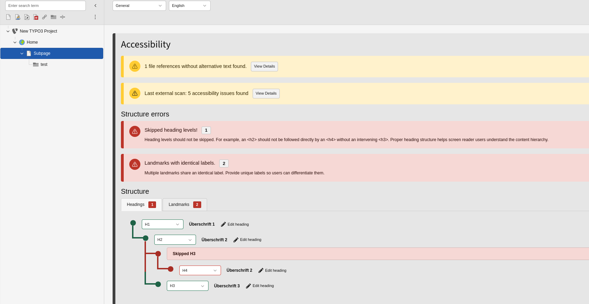
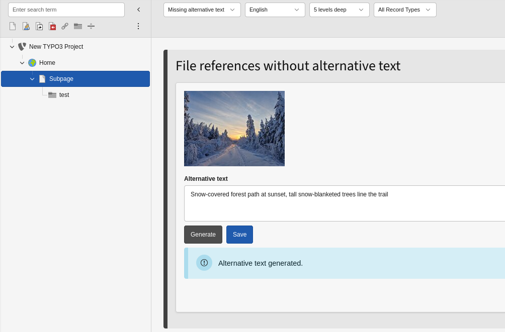
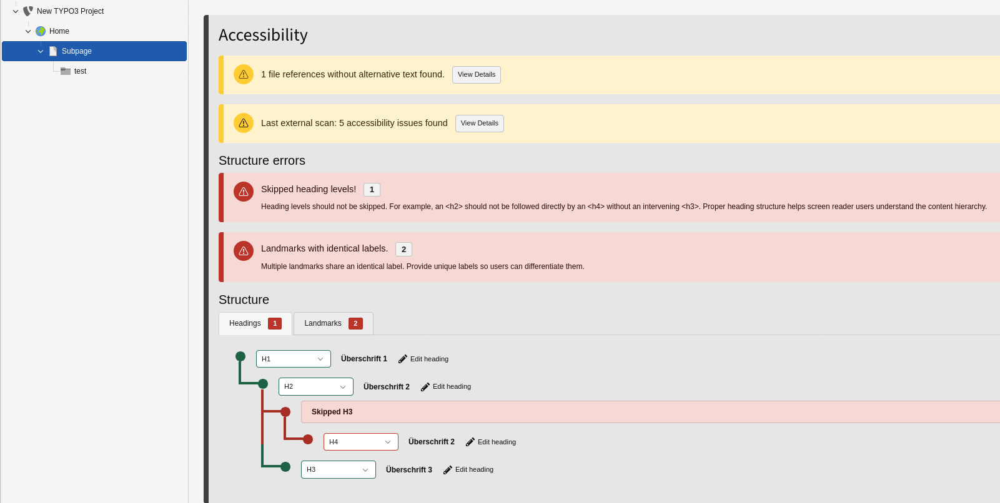
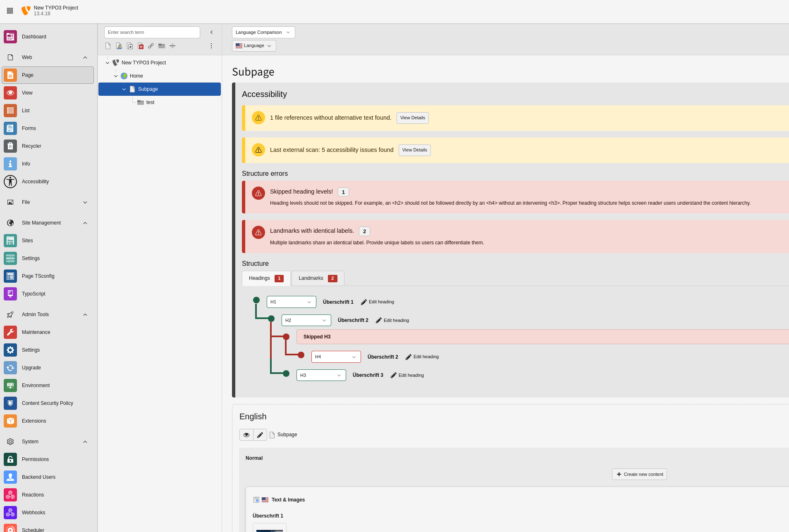

# Editors

This section is for backend editors working with accessibility content checks.

## Prerequisites

- You can access **Web > Accessibility**.
- You can access the page in the page tree.
- Relevant features are enabled by your integrator.

## Where to work

Open **Web > Accessibility** for the current page.

## Access and scope

You need access to the module **Web > Accessibility** and read access to the selected page.

Feature visibility depends on project configuration:

- Missing alternative text can be disabled per page tree.
- Scanner can be disabled per page tree.
- Heading and landmark structure checks can be disabled per page tree.

## General view: quick status

The **General** feature provides a quick accessibility overview for the current page:

- heading structure status
- landmark structure status
- missing alt text count
- scanner status (if enabled and configured)

From there, you can open detailed views.

## Missing alternative text: find and fix

Open feature **Missing alternative text** to review file references that miss alt text.

You can:

- filter by record type
- change scan depth in the page tree (`1`, `5`, `10`, `99` levels)
- switch language
- edit alt text inline
- jump to the original record

If OpenAI is configured and your file type is supported (`jpg`, `jpeg`, `png`, `webp`, `gif`), a **Generate** button appears for automatic suggestions.

## Heading and landmark checks

Heading and landmark checks are shown in the **General** feature.

When your project templates use Mindful A11y heading/landmark output, the module can:

- analyze heading hierarchy (for example skipped levels)
- analyze landmark structure
- show issues directly in the backend context

## Scanner usage

If scanner integration is enabled and configured:

- you can trigger scans from the module
- **Targeted Scan** checks the current page, or current page plus child pages based on the selected scope menu
- **Full Site Crawl** follows links from a site root page and scans reachable pages in that site area
- Full Site Crawl is available only on site root pages
- results include severity, selector, context, and issue details
- reports can be downloaded as HTML or PDF

Scanner actions are available only after your integrator has set up MindfulAPI with Docker and enabled the scanner for your page tree.

For scanner results, pages must be frontend-accessible and previewable.

Scanner results come from technical automated checks (axe-core via MindfulAPI). They are reliable for many technical violations, but they do not replace manual content and UX accessibility review.

## Page module info box

In the regular page module, Mindful A11y can display a compact accessibility info box with quick links and issue counts.

