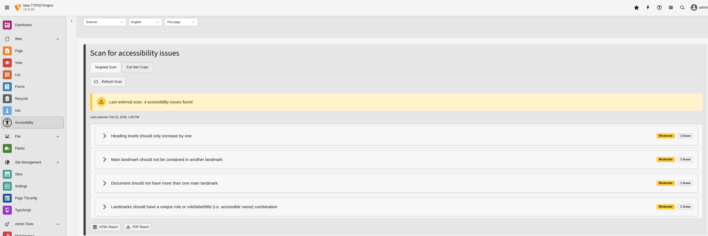
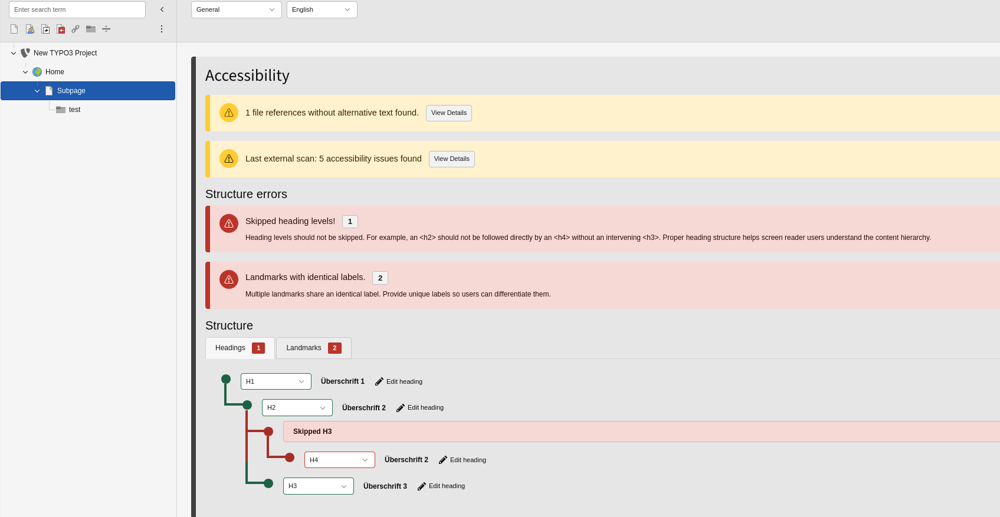
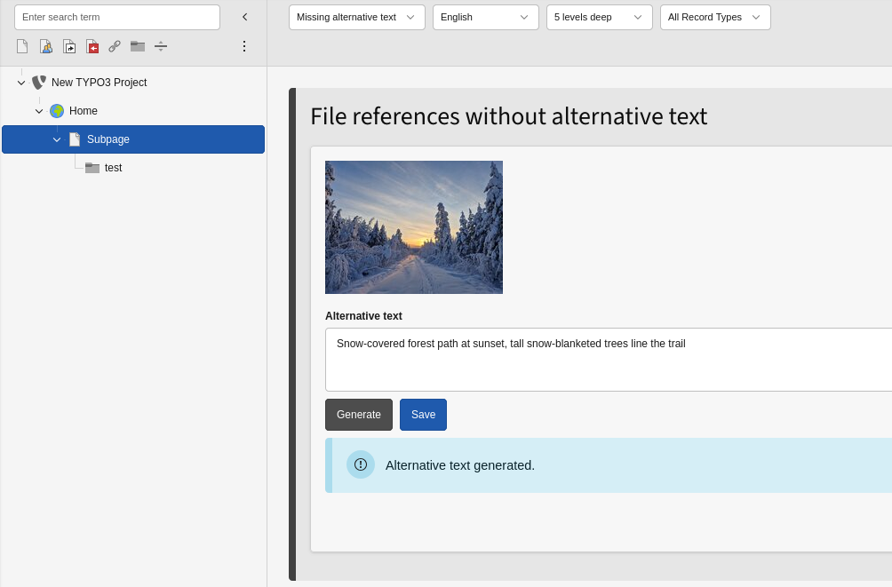
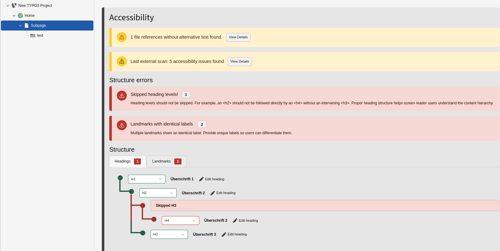
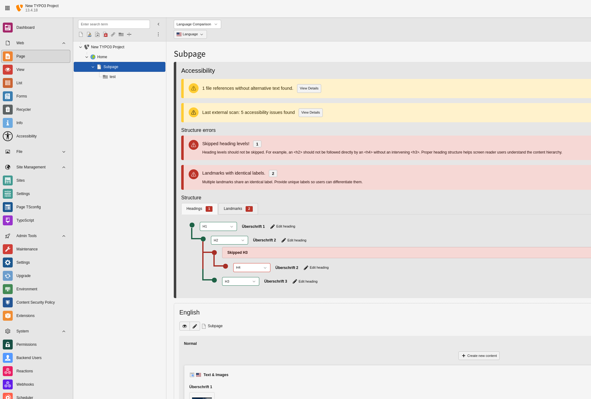

# Editors

This section is for backend editors working with accessibility content checks.

## Prerequisites

- You can access **Web > Accessibility**.
- You can access the page in the page tree.
- Relevant features are enabled by your integrator.

## Where to work

Open **Web > Accessibility** for the current page.

## Access and scope

You need access to the module **Web > Accessibility** and read access to the selected page.

Feature visibility depends on project configuration:

- Missing alternative text can be disabled per page tree.
- Scanner can be disabled per page tree.
- Heading and landmark structure checks can be disabled per page tree.

## Overview: quick status

The **Overview** feature provides a quick accessibility overview for the current page:

- heading structure status
- landmark structure status
- missing alt text count
- scanner status (if enabled and configured)

From there, you can open detailed views.

## Missing alternative text: find and fix

Open feature **Missing alternative text** to review file references that miss alt text.

You can:

- filter by record type
- keep the default scope on the current page or include direct, multiple, or all subpages
- switch language
- edit alt text inline
- mark an image reference as decorative directly in the module card or in its file-reference editor
- jump to the original record

If OpenAI is configured and your file type is supported (`jpg`, `jpeg`, `png`, `webp`, `gif`), a **Generate** button appears for automatic suggestions.

Use **Decorative image** directly on the affected module card only when an image adds no information. Saving this option removes the
reference's alternative text and title, hides both fields, and removes the reference from the
missing-alt check. A visible caption can still be entered in the description field. Turn the
option off before entering alternative text or a title again.

## Heading and landmark checks

Heading and landmark checks are shown in the **Overview** feature.

When your project templates use Mindful A11y heading/landmark output, the module can:

- analyze heading hierarchy (for example skipped levels)
- analyze landmark structure
- distinguish findings that occur in the mobile or desktop layout
- show issues directly in the backend context

Headings inside a container element can derive their level from the container's
**Headings inside this element** field. That field is edited on the container's own row in the heading
tree — the select always shows the container's current setting — and changing it updates all
headings of that container at once, including any headings nested below them. The field offers
the regular heading levels (1–6 and paragraph) plus **Automatic — next level**, which follows
the page structure by using one level below the container's own heading. Choose a fixed level
only when the preview shows that the automatic result is incorrect. A container without a heading of its own (for example a hidden
header) still appears as a **Hidden container element** row so the field stays reachable. The headings derived
from a container are shown read-only in the tree; each links back to its container's row. When a
hidden container makes its child headings skip a level, the issue is shown once on the
container's row — change its **Headings inside** setting there to close the gap — instead of as
separate missing-level placeholders under every child.

The checks use the page's rendered CSS at representative mobile and desktop sizes, including when a TYPO3 installation serves different site roots on different domains. Elements hidden from assistive technology in a layout do not affect that layout's results. JavaScript-generated headings and landmarks are not included.

## Scanner usage

- you can trigger scans from the module
- **Targeted Scan** checks the current page, or current page plus child pages based on the selected scope menu
- **Full Site Crawl** follows links from a site root page and scans reachable pages in that site area
- Full Site Crawl is available only on site root pages
- results include severity, selector, context, and issue details
- reports can be downloaded as HTML or PDF

Scanner actions are available only after your integrator has set up MindfulAPI with Docker and enabled the scanner for your page tree.

For scanner results, pages must be frontend-accessible and previewable.

Scanner results come from technical automated checks (axe-core via MindfulAPI). They are reliable for many technical violations, but they do not replace manual content and UX accessibility review.

## Page module info box

In the regular page module, Mindful A11y can display a compact accessibility info box with quick links and issue counts.

