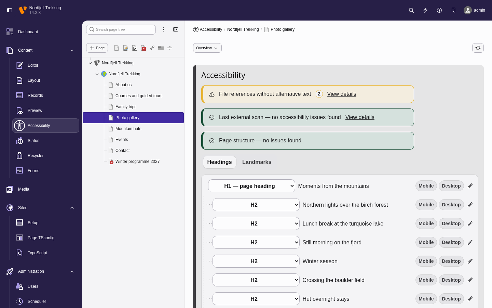
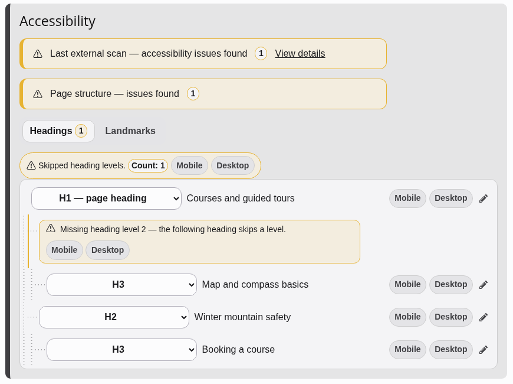
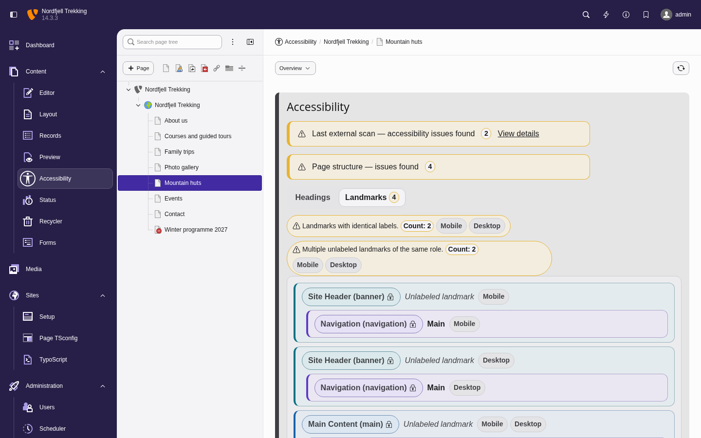
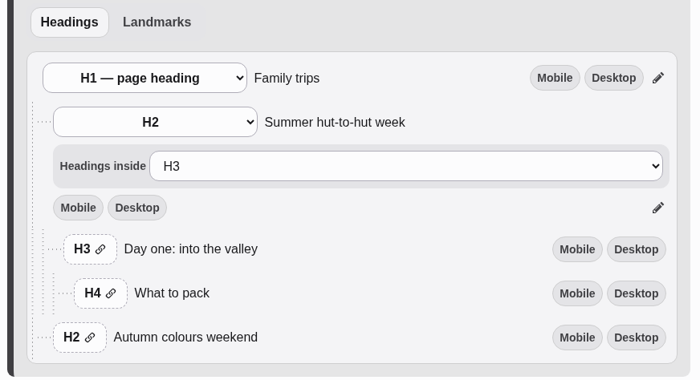
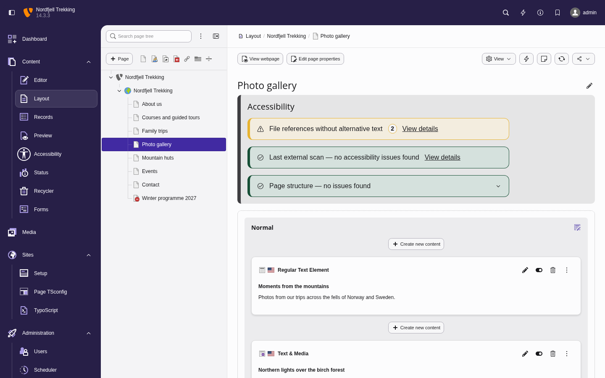
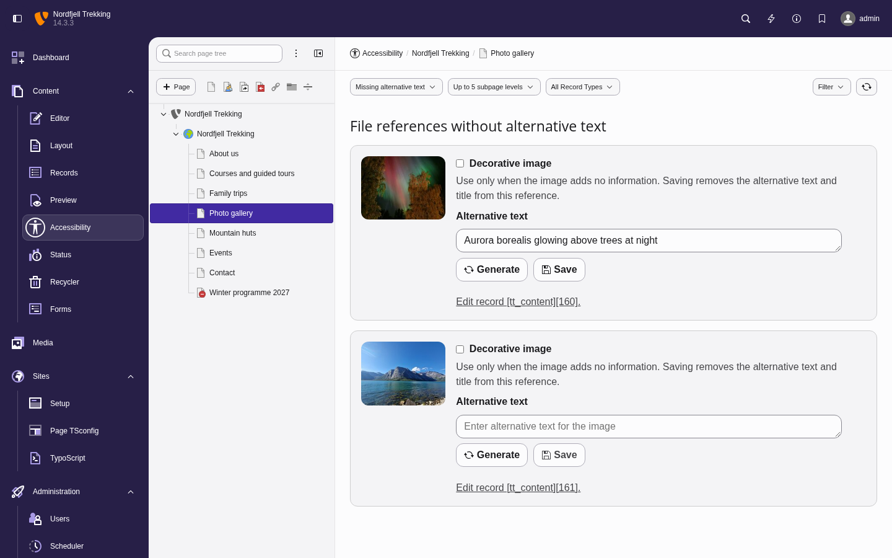
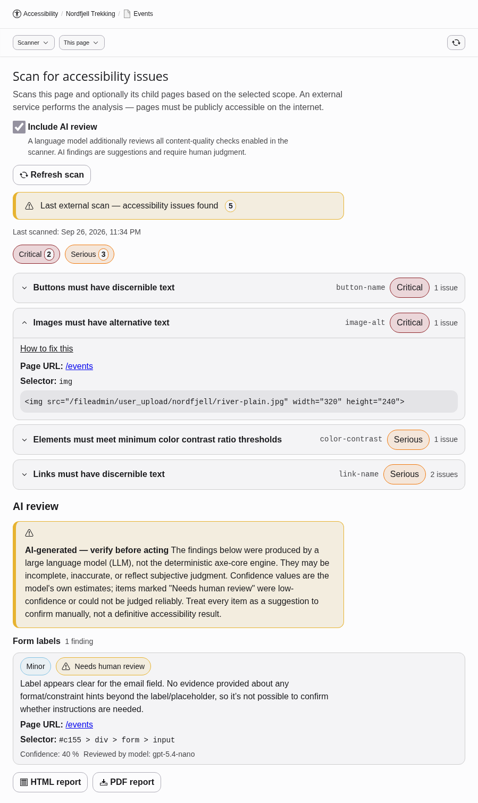

# Editors

This guide shows backend editors how to check and fix the accessibility of their pages.

## Where to work

Open **Web > Accessibility** (TYPO3 14: **Content > Accessibility**) and select a page in the
page tree. You need access to the module and read access to the page.

Your integrator can switch off the structure checks, **Missing alternative text** and the
**Scanner** for each page tree. A short status also appears in the
[Page module info box](#page-module-info-box).

## Overview: page status and structure

The **Overview** shows how many images miss alternative text, the scanner status (if set up)
and the heading and landmark structure. Each notice links to its detailed view.

### Heading and landmark structure

The **Headings** and **Landmarks** tabs show the structure of the rendered page as a tree. This
is what visitors and screen readers get. The page is checked in a mobile and a desktop layout.

Findings, such as a skipped heading level or two landmarks with the same name, appear above the
tree and on the affected rows. **Mobile** and **Desktop** labels show which layout they apply to.

Fix most findings directly in the tree:

- **Heading level:** choose another level in the heading's select, or **Paragraph — not a
  heading** to remove it from the structure. The change is saved immediately.
- **Landmark role:** choose another role in the landmark's select.
- **Edit heading** / **Edit landmark** (pencil) opens the content element, for example to change
  a heading text or landmark name.

Rows without a select are not editable. They come from the page template (ask your integrator)
or inherit their level from another element. An inherited heading links to the heading that
controls it.

#### Headings above the page heading

Some headings appear before the page heading (H1), for example the title of a navigation or a
sidebar. These headings should be H2. If such a heading is H3 or lower and there is no H2 above
it, the module suggests changing it to H2.

#### Headings inside container elements

A container element can set the level of all headings inside it, including nested ones. Use its
**Headings inside** select in the tree (in the record editor: **Headings inside this element**).

- **Automatic — next level** uses one level below the container's own heading.
- Choose a fixed level only if the tree shows that the automatic level is wrong.

Headings inside a container are read-only and link back to the container's row. A container
without a heading of its own appears as **Container without its own heading**, so you can still
change the setting.

If a container's headings skip a level or start too deep, the finding is shown once on the
container's row. Fix it by changing that row's **Headings inside** select.

#### What the check leaves out

Elements hidden from screen readers in a layout do not count for that layout. Headings and
landmarks added by JavaScript are not checked.

> **Note:** If the analysis says the page requires a sign-in (for example on a password-protected
> staging site), choose **Open page in new tab**, sign in there, then choose **Retry**. The
> browser remembers the sign-in until you close it.

## Page module info box

The page module can show a compact box with issue counts and quick links. The heading and
landmark structure is one row with the number of structure issues. Select it to unfold the full
structure. It stays unfolded on the next pages until you fold it again.

## Missing alternative text: find and fix

**Missing alternative text** lists image references without alternative text. You can:

- edit the alternative text in each card
- mark an image as **Decorative image**
- open the original record
- filter by **Record Type**, switch the **Language**, and include subpages with **Page Scope**

**Generate** suggests a text if OpenAI is set up. It supports `jpg`, `jpeg`, `png`, `webp` and
`gif` files up to 20 MB. The button also appears next to the alternative text field when you
edit an image reference or a file's metadata. Always review a generated text before you save it.
If the AI considers the image purely decorative, no text is filled in and a message says so.
Decide yourself: mark the image as **Decorative image**, or write the alternative text.

### Decorative images

Use **Decorative image** only when an image adds no information. Saving it removes the
alternative text and title, hides both fields and takes the image out of this list. You can
still enter a visible caption in the description field. To add alternative text again, turn the
option off first.

### Filter menu

By default the list hides decorative images, references that already have alternative text, and
references that inherit alternative text from the file metadata. The **Filter** menu changes
this; each option works on its own:

- **Show decorative images:** check that images were marked decorative correctly.
- **Show all references:** also list references with their own alternative text. You see the
  text even if you may not edit it.
- **Hide records with inherited alternative text:** on by default. Turn it off to list
  references covered by metadata text.

## Scanner usage

The **Scanner** needs MindfulAPI, set up and enabled by your integrator. You can scan in the live
workspace, on pages you may edit. The pages must be reachable and previewable in the frontend.

- **Targeted scan** checks the current page, plus child pages depending on **Page Scope**.
- **Full-site crawl** (site root pages only) follows links within the page's language and scans
  the pages it reaches (by default at most 250).
- **Include AI review** (if enabled) adds a language-model review of content quality, such as
  alternative text and link purpose. Its findings appear under **AI review**. Always check them
  yourself.

Each result shows severity, the affected element, context and details. Download the results as
**HTML report** or **PDF report**.

A result only covers the pages the scanner could load. If it reports **no page could be scanned**
or that some pages **could not be scanned**, those pages were not checked at all — ask your
integrator to make them reachable for the scanner, then scan again.

The scanner runs automated technical checks (axe-core). They find many problems, but do not
replace a manual review of content and usability.

> **Note:** Scan and **Generate** requests are valid for 15 minutes after the page loads. If you
> see **Invalid request signature**, save your changes, reload the page and try again.

