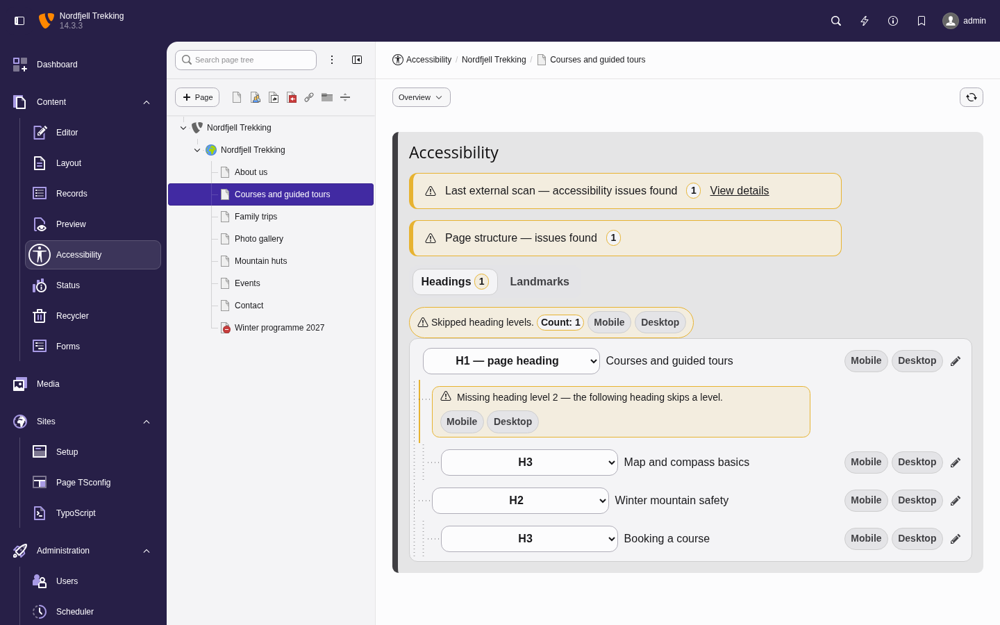

# Mindful A11y

Mindful A11y brings accessibility checks and fixes directly into the TYPO3 backend.

## What you can do with this extension

- Check the heading and landmark structure of the rendered page, and fix heading levels and
  landmark roles in the backend (fixing requires the extension's Fluid ViewHelpers in templates)
- Find and fix missing image alternative text, optionally with AI suggestions; mark images
  decorative
- Run automated page scans through the external MindfulAPI service (optional)
- Prefix the page title after failed server-side EXT:form validation (optional)

## Read by role

- [Editors](Editors/Index.md): find and fix issues in the Accessibility module and the page module
- [Integrators](Integrators/Index.md): install, configure, grant permissions, and roll out features
- [Developers](Developers/Index.md): render headings and landmarks with the ViewHelpers; extend
  custom records

## Where editors work

- **Accessibility module → Overview**: page status, heading and landmark structure with
  findings, and links to details
- **Accessibility module → Missing alternative text**: list, filter, generate, and save
  alternative text
- **Accessibility module → Scanner** (optional): run scans, review results, export reports
- **Page module info box**: the same status at a glance above the page content

## Requirements

- TYPO3 `13.4 LTS` (13.4.18 or later) or `14.3 LTS`
- PHP `8.2` to `8.4`
- Optional: [MindfulAPI](https://github.com/crinis/mindfulapi) **v0.7.0 or later** for the scanner
  (see [Scanner integration](Integrators/Index.md#scanner-integration)), an OpenAI API key for AI
  alternative text, and `typo3/cms-form` for the validation-error title prefix (enable it with
  `enableValidationErrorTitlePrefix` in the extension configuration)
