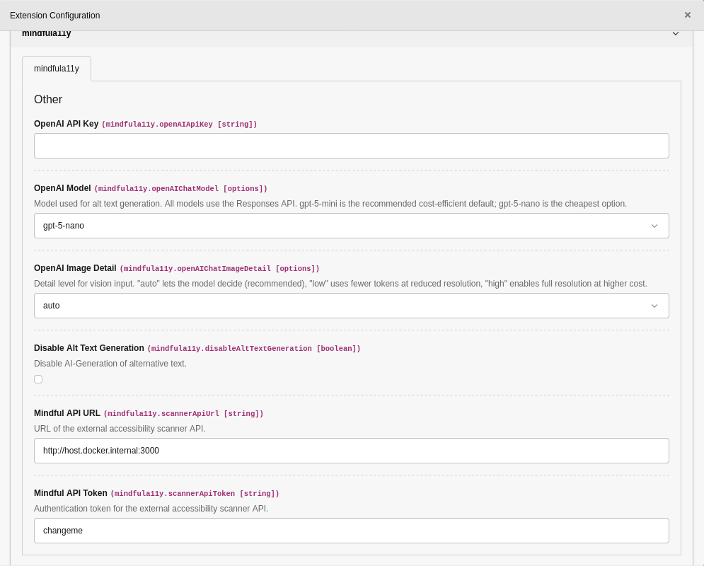
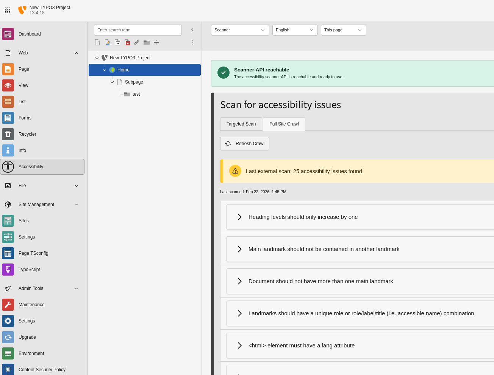
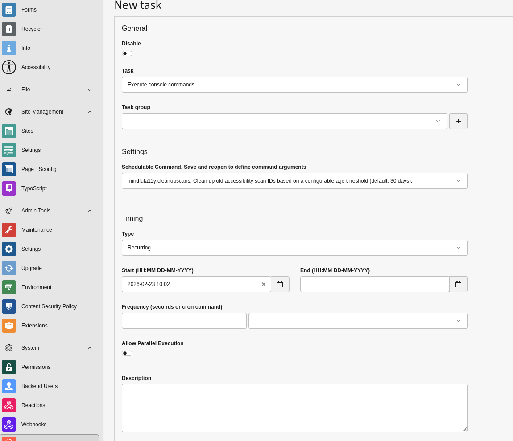

# Integrators

This section is for TYPO3 integrators and administrators configuring the extension.

## Installation

```bash
composer require mindfulmarkup/mindfula11y
```

Install/activate the extension in TYPO3 as usual.

## Extension configuration

Configure in **Admin Tools > Settings > Extension Configuration**.



| Setting | Purpose |
| --- | --- |
| `openAIApiKey` | API key used for AI alt text generation. |
| `openAIChatModel` | Model used for generation (`gpt-5-nano`,`gpt-5-mini`, `gpt-5.1`, `gpt-5.2`). |
| `openAIChatImageDetail` | Image analysis depth (`auto`, `low`, `high`) for quality/cost tuning. |
| `disableAltTextGeneration` | Turn off AI generation globally while keeping manual alt editing. |
| `scannerApiUrl` | Base URL of your scanner service. Use full format with protocol and optional port, without path. Example: `http://localhost:3000` (MindfulAPI Docker default) or `https://scanner.example.com`. |
| `scannerApiToken` | Bearer token used to authenticate TYPO3 against the scanner API (if enabled there). |

## Feature activation checklist

1. Enable or disable module features in Page TSconfig.
2. Configure OpenAI only when AI alt text generation should be available.
3. Configure scanner only after MindfulAPI is reachable from TYPO3.
4. Grant backend module, table, and file permissions to target editor groups.

## Page TSconfig

Default options shipped by the extension:

```typoscript
mod {
    mindfula11y_accessibility {
        missingAltText {
            enable = 1
            ignoreColumns {
                tt_content = image
            }
            ignoreFileMetadata = 1
        }
        headingStructure {
            enable = 1
        }
        landmarkStructure {
            enable = 1
        }
        scan {
            enable = 0
            autoCreate = 1
            # basicAuthUsername =
            # basicAuthPassword =
        }
    }

    web_layout {
        mindfula11y {
            hideInfo = 0
        }
    }
}

TCEFORM.tt_content.tx_mindfula11y_landmark {
    removeItems = main,banner,contentinfo
}
```

### TSconfig options explained

| Option | Used for |
| --- | --- |
| `mod.mindfula11y_accessibility.missingAltText.enable` | Shows/hides Missing alternative text feature. |
| `mod.mindfula11y_accessibility.missingAltText.ignoreColumns` | Excludes specific file fields from missing-alt checks. |
| `mod.mindfula11y_accessibility.missingAltText.ignoreFileMetadata` | Controls whether inherited file metadata alt text is considered. |
| `mod.mindfula11y_accessibility.headingStructure.enable` | Enables heading structure checks in module. |
| `mod.mindfula11y_accessibility.landmarkStructure.enable` | Enables landmark structure checks in module. |
| `mod.mindfula11y_accessibility.scan.enable` | Enables scanner feature in module. |
| `mod.mindfula11y_accessibility.scan.autoCreate` | Auto-starts new scan on module load when content changed. |
| `mod.mindfula11y_accessibility.scan.basicAuthUsername` | Username used only when target frontend is protected by HTTP Basic Auth. |
| `mod.mindfula11y_accessibility.scan.basicAuthPassword` | Password used only when target frontend is protected by HTTP Basic Auth. |
| `mod.web_layout.mindfula11y.hideInfo` | Hides Mindful A11y info box in page module header area. |

## Scanner integration

Before enabling scanner features, you must set up an external scanner service.

Scanner functionality stays disabled until you explicitly set `mod.mindfula11y_accessibility.scan.enable = 1` in Page TSconfig.

**Required:** [MindfulAPI](https://github.com/crinis/mindfulapi) running via Docker.

Minimal setup:

```bash
git clone https://github.com/crinis/mindfulapi.git
cd mindfulapi
cp .env.example .env
docker compose up -d
```

Then configure `scannerApiUrl` (and `scannerApiToken` if enabled in MindfulAPI).

Mindful A11y scanner features use this external project to run **automated technical scans with axe-core in a real browser (headless) environment**.

Common setup:

1. Ensure MindfulAPI is running via Docker.
2. Set `scannerApiUrl` and optional `scannerApiToken`.
3. Enable scanner in TSconfig: `mod.mindfula11y_accessibility.scan.enable = 1`.

Without both a reachable MindfulAPI service and `mod.mindfula11y_accessibility.scan.enable = 1`, scanner UI/actions remain unavailable.

### Scan modes: Targeted Scan vs Full Site Crawl

- **Targeted Scan** scans the current page URL, or a defined child-page scope from the scan scope menu (`0/1/5/10/99` levels).
- **Full Site Crawl** starts from the selected page URL and discovers linked pages automatically within the selected site/language URL space.
- Full Site Crawl is available **only** for site root pages (`is_siteroot = 1`).
- On non-root pages, editors only get Targeted Scan.



### Scanner quality and limitations

- These automated checks are reliable for many technical accessibility violations.
- They cannot detect every accessibility problem (for example content meaning, context, editorial quality, or all UX issues).
- Treat scanner output as a strong technical baseline and combine it with editorial/manual accessibility reviews.

### Scanning pages behind HTTP Basic Authentication

If your frontend is protected by HTTP Basic Auth, set both TSconfig keys:

- `mod.mindfula11y_accessibility.scan.basicAuthUsername`
- `mod.mindfula11y_accessibility.scan.basicAuthPassword`

The extension sends these credentials server-side to the scanner so protected pages can still be scanned.

Both values are required; if one is missing, no credentials are sent.

> Security note: keep scanner credentials scoped to a low-privilege account. Page TSconfig is backend-managed configuration and should be treated as sensitive project configuration.

## Permissions checklist

Grant users at least:

- backend module access: `mindfula11y_accessibility`
- page read access in relevant trees (`PAGE_SHOW`)
- allowed languages for selected page language contexts
- file mount read access for media used in alt text workflows

For editing/generation features, additionally ensure:

- `sys_file_reference` write access and field access to `alternative` (manual alt edits)
- `sys_file_metadata` access to `alternative` (inherited alt context/filtering)
- file metadata edit permissions for metadata-level AI generation (file mount `editMeta`)
- page field access for scanner state fields: `pages.tx_mindfula11y_scanid` and `pages.tx_mindfula11y_scanupdated`
- page content edit permission when users should be allowed to trigger new scans

Without these permissions, editors may see partial module functionality or disabled actions.

## Maintenance command

The extension provides:

```bash
vendor/bin/typo3 mindfula11y:cleanupscans
vendor/bin/typo3 mindfula11y:cleanupscans --seconds=604800
```

Purpose of this command:

- removes outdated `tx_mindfula11y_scanid` values from page records
- prevents editors from seeing stale scan references after scanner-side retention cleanup
- ensures the next scan run creates fresh scan data instead of reusing invalid IDs

Use Scheduler/cron to keep TYPO3 scan references aligned with your MindfulAPI retention policy.


