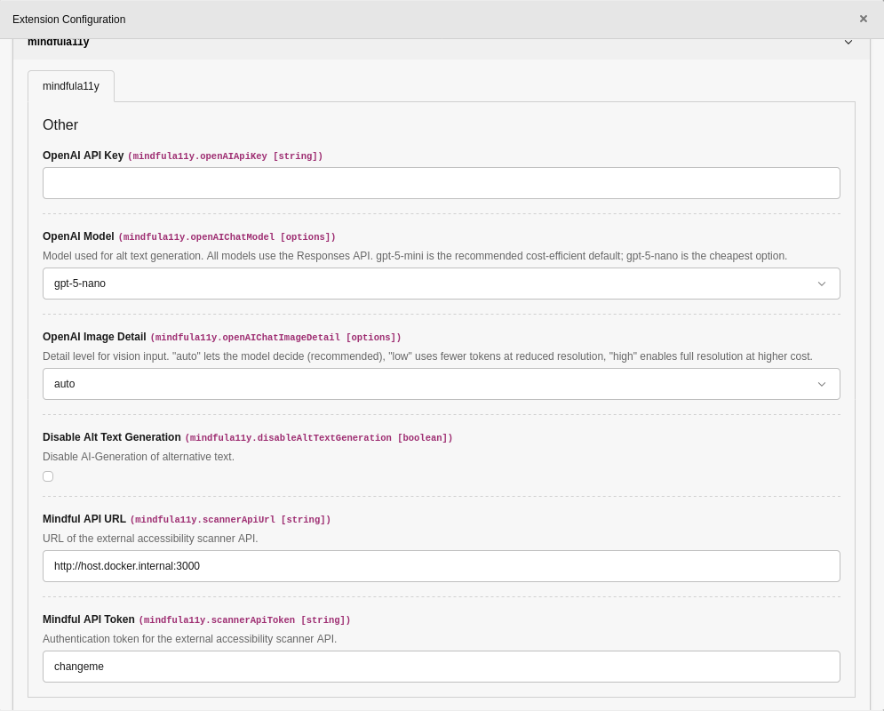
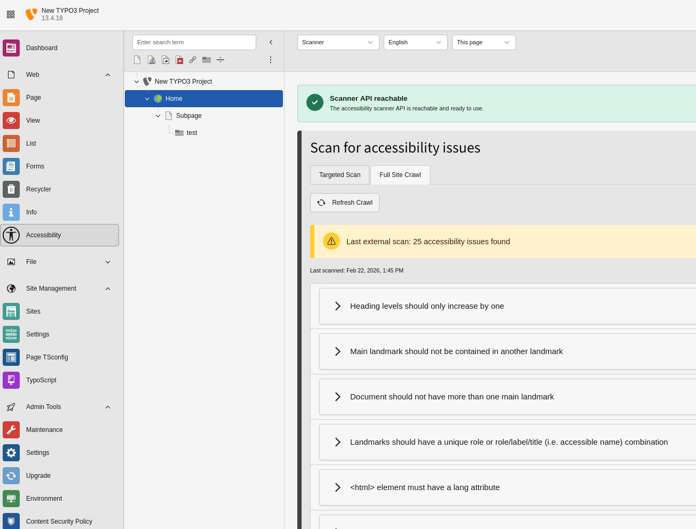
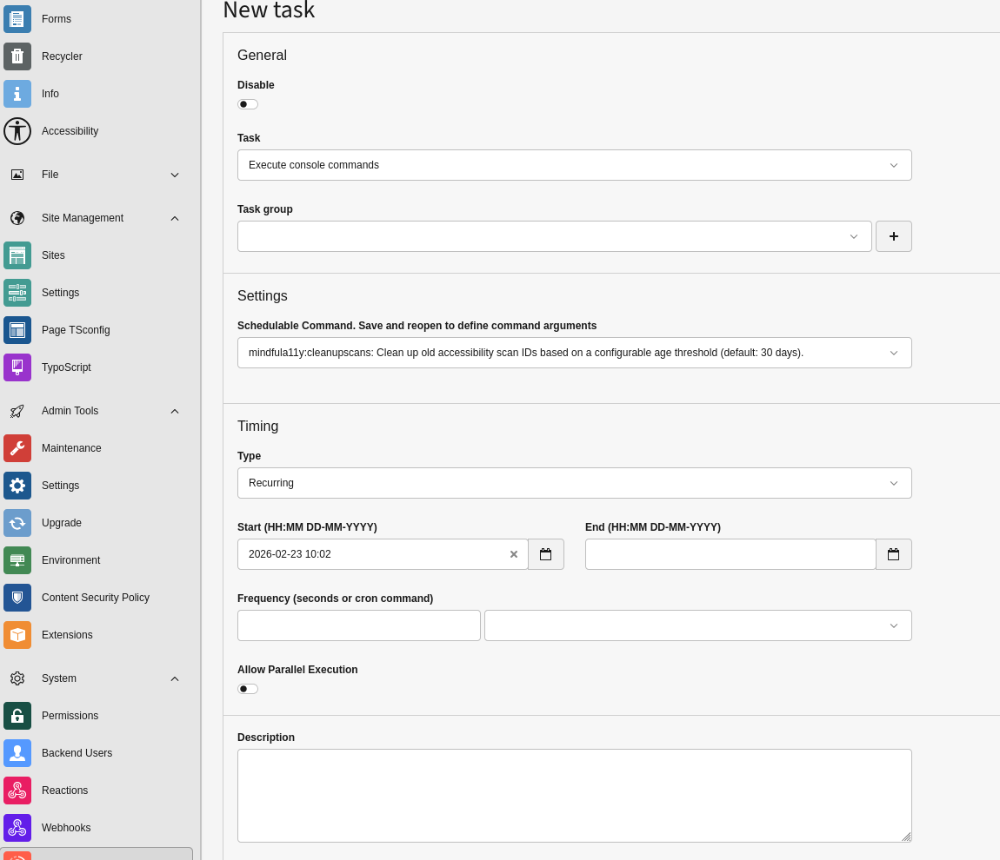

# Integrators

This section is for TYPO3 integrators and administrators configuring the extension.

## Installation

```bash
composer require mindfulmarkup/mindfula11y
```

Install/activate the extension in TYPO3 as usual.

## Extension configuration

Configure in **Admin Tools > Settings > Extension Configuration**.



| Setting | Purpose |
| --- | --- |
| `openAIApiKey` | API key used for AI alt text generation. |
| `openAIChatModel` | Model used for generation (`gpt-5.4-mini`, `gpt-5.4-nano`, `gpt-5-mini`, `gpt-5-nano`, `gpt-5.1`, `gpt-5.2`). |
| `openAIChatImageDetail` | Image analysis depth (`auto`, `low`, `high`) for quality/cost tuning. |
| `disableAltTextGeneration` | Turn off AI generation globally while keeping manual alt editing. |
| `scannerApiUrl` | Base URL of your scanner service. Use full format with protocol and optional port, without path. Example: `http://localhost:3000` (MindfulAPI Docker default) or `https://scanner.example.com`. |
| `scannerApiToken` | Bearer token used to authenticate TYPO3 against the scanner API (if enabled there). |
| `enableValidationErrorTitlePrefix` | Prefixes the page title with a localized `Error:` after failed server-side EXT:form validation. Disabled by default. |

### Keeping secrets out of settings.php

Values entered in the Settings UI are written in plaintext to `config/system/settings.php`,
which many projects keep under version control. Keep `openAIApiKey` and `scannerApiToken` out
of that file by leaving both fields empty in the UI and overriding them from environment
variables in `config/system/additional.php`:

```php
$GLOBALS['TYPO3_CONF_VARS']['EXTENSIONS']['mindfula11y']['openAIApiKey'] = getenv('OPENAI_API_KEY') ?: '';
$GLOBALS['TYPO3_CONF_VARS']['EXTENSIONS']['mindfula11y']['scannerApiToken'] = getenv('MINDFULAPI_TOKEN') ?: '';
```

`additional.php` is loaded after `settings.php`, so the environment values win at runtime.
Note that the Settings UI keeps showing and saving the `settings.php` values — it does not
reflect the override.

### Validation-error page-title prefix

When a TYPO3 EXT:form submission fails server-side validation, Mindful A11y prefixes the final
page title with a localized `Error:` (`Fehler:` in German). Screen readers encounter the failure
state in the title as soon as the response loads, following the GOV.UK validation pattern.

The behavior is disabled by default. Set `enableValidationErrorTitlePrefix` in
**Admin Tools > Settings > Extension Configuration** to enable it globally. Extension
Configuration is used because this is frontend response policy for the installation; Page TSconfig
controls backend and editor behavior and is therefore not the appropriate configuration layer.

`typo3/cms-form` is an optional dependency. If it is not installed, the integration remains
inactive and Mindful A11y continues to operate normally. If it is installed, detection is automatic
and requires no Fluid partial, marker, TypoScript, or JavaScript. Native HTML5 validation is
unaffected: it prevents an invalid submission in the browser without loading a new response, so the
page title correctly remains unchanged.

## Feature activation checklist

1. Enable or disable module features in Page TSconfig.
2. Configure OpenAI only when AI alt text generation should be available.
3. Configure scanner only after MindfulAPI is reachable from TYPO3.
4. Grant backend module, table, and file permissions to target editor groups.

## Page TSconfig

Default options shipped by the extension:

```typoscript
mod {
    mindfula11y_accessibility {
        missingAltText {
            enable = 1
            # ignoreColumns {
            #     <table> = <column>,<column>
            # }
            ignoreFileMetadata = 0
        }
        headingStructure {
            enable = 1
        }
        landmarkStructure {
            enable = 1
        }
        scan {
            enable = 0
            autoCreate = 1
            aiAudit {
                enable = 0
                default = 0
                # skills = image_alt_text,page_title
            }
        }
    }

    web_layout {
        mindfula11y {
            hideInfo = 0
        }
    }
}

TCEFORM.tt_content.tx_mindfula11y_landmark {
    removeItems = main,banner,contentinfo,form
}
```

### TSconfig options explained

| Option | Used for |
| --- | --- |
| `mod.mindfula11y_accessibility.missingAltText.enable` | Shows/hides Missing alternative text feature. |
| `mod.mindfula11y_accessibility.missingAltText.ignoreColumns` | Excludes specific file fields from missing-alt checks, per table: `ignoreColumns { <table> = <column>,<column> }`. |
| `mod.mindfula11y_accessibility.missingAltText.ignoreFileMetadata` | With `0` (default), editors can filter out references covered by file metadata alternative text, matching TYPO3's rendered `FileReference`. Set `1` to ignore metadata and require alternative text directly on every file reference. |
| `mod.mindfula11y_accessibility.headingStructure.enable` | Enables heading structure checks in module. |
| `mod.mindfula11y_accessibility.landmarkStructure.enable` | Enables landmark structure checks in module. |
| `mod.mindfula11y_accessibility.scan.enable` | Enables scanner feature in module. |
| `mod.mindfula11y_accessibility.scan.autoCreate` | Auto-starts new scan on module load when content changed. |
| `mod.mindfula11y_accessibility.scan.basicAuthUsername` | Deprecated — use the site setting `mindfula11y.scan.basicAuth.username` (see [Scanning pages behind HTTP Basic Authentication](#scanning-pages-behind-http-basic-authentication)). |
| `mod.mindfula11y_accessibility.scan.basicAuthPassword` | Deprecated — use the site setting `mindfula11y.scan.basicAuth.password` (supports `%env()%` placeholders, same section). |
| `mod.mindfula11y_accessibility.scan.aiAudit.enable` | Offers the "Include AI review" toggle in the scan module; requires MindfulAPI's agent feature (see [AI review](#ai-review-agent-audit)). |
| `mod.mindfula11y_accessibility.scan.aiAudit.default` | Pre-selects the AI review toggle for new scans; editors can still switch it off per scan. |
| `mod.mindfula11y_accessibility.scan.aiAudit.skills` | Optional comma-separated skill subset. Unset requests every MindfulAPI-enabled skill; an empty value requests none. |
| `mod.web_layout.mindfula11y.hideInfo` | Hides Mindful A11y info box in page module header area. |

Heading and landmark checks render the real frontend preview in isolated iframes at 375 × 812 and 1280 × 900 CSS pixels. Site roots on another domain are supported without MindfulAPI: the authenticated backend issues a signed, stateless ticket that is valid for 15 seconds and bound to the exact page, language, workspace, frontend URL, backend origin, and backend user. Current module, account, DB-mount, page, workspace, and language permissions are checked again whenever the ticket is redeemed. The ticket is intentionally reusable during its short validity window; it is not stored in a cache or database. HTTPS should be used, and reverse proxies or application monitoring should avoid recording sensitive query strings.

The frontend returns the result through a `MessageChannel`. The extension adds the required per-request CSP permissions and runs only its analysis module; ordinary page scripts and JavaScript-generated structure are not included. Responses use `no-store` and `no-referrer`, and the iframe has an opaque sandbox origin. Web-server or reverse-proxy `X-Frame-Options`/CSP headers added after TYPO3 can still prevent framing and must allow the TYPO3 backend origin.

## Scanner integration

Before enabling scanner features, you must set up an external scanner service.

Scanner functionality stays disabled until you explicitly set `mod.mindfula11y_accessibility.scan.enable = 1` in Page TSconfig.

**Required:** [MindfulAPI](https://github.com/crinis/mindfulapi) **version 0.7.0 or later** running via Docker. This extension talks to the versioned `/v1` API routes and consumes the AI agent audit fields (audit status, agent findings), both introduced in MindfulAPI v0.7.0 — older MindfulAPI releases are not supported.

Minimal setup:

```bash
git clone https://github.com/crinis/mindfulapi.git
cd mindfulapi
cp .env.example .env
docker compose up -d
```

Then configure `scannerApiUrl` (and `scannerApiToken` if enabled in MindfulAPI).

Mindful A11y scanner features use this external project to run **automated technical scans with axe-core in a real browser (headless) environment**.

Common setup:

1. Ensure MindfulAPI is running via Docker.
2. Set `scannerApiUrl` and optional `scannerApiToken`.
3. Enable scanner in TSconfig: `mod.mindfula11y_accessibility.scan.enable = 1`.

Without both a reachable MindfulAPI service and `mod.mindfula11y_accessibility.scan.enable = 1`, scanner UI/actions remain unavailable.

### Scan modes: Targeted Scan vs Full Site Crawl

- **Targeted Scan** scans the current page URL, or a defined child-page scope from the scan scope menu (`0/1/5/10/99` levels).
- **Full Site Crawl** starts from the selected page URL and discovers linked pages automatically within the selected site/language URL space.
- Full Site Crawl is available **only** for site root pages (`is_siteroot = 1`).
- On non-root pages, editors only get Targeted Scan.



### Scanner quality and limitations

- These automated checks are reliable for many technical accessibility violations.
- They cannot detect every accessibility problem (for example content meaning, context, editorial quality, or all UX issues).
- Treat scanner output as a strong technical baseline and combine it with editorial/manual accessibility reviews.

### Scanning pages behind HTTP Basic Authentication

If your frontend is protected by HTTP Basic Auth, configure the credentials as site settings in `config/sites/<identifier>/settings.yaml`:

```yaml
mindfula11y:
  scan:
    basicAuth:
      username: 'scanner'
      password: '%env(MINDFULA11Y_SCAN_BASIC_AUTH_PASSWORD)%'
```

The extension reads these credentials server-side for the site of the scanned page and forwards them to the scanner so protected pages can still be scanned; they are never exposed to the browser. Multi-site installations therefore scope credentials to exactly the protected host. The password (or username) may reference an environment variable via TYPO3's `%env(...)%` placeholder syntax, keeping the secret out of the committed file. Both values are required; if one is missing, no credentials are sent.

Use the nested tree form shown above. The extension deliberately ships no settings definition for these keys, so the secret never surfaces in the backend site settings editor — and settings without a definition are only resolvable in tree form.

> Deprecated: the Page TSconfig keys `mod.mindfula11y_accessibility.scan.basicAuthUsername` / `basicAuthPassword` still work as a fallback. They cannot reference environment variables and apply per page tree rather than per site. As soon as either site setting is set, the site settings are authoritative — a partially configured pair sends no credentials instead of falling back to TSconfig.

> Security note: keep scanner credentials scoped to a low-privilege account. When using `%env()%` placeholders, treat `settings.yaml` as deploy-managed: saving site settings through the backend editor may write resolved values back to the file.

### AI review (agent audit)

MindfulAPI (v0.7.0 or later, see above) can optionally run an **AI audit** alongside the axe-core scan: a language model reviews content quality aspects (image alternative text, heading structure, link purpose, form labels, page title) and reports findings with severity, confidence and suggestions. AI findings are shown in a separate "AI review" section and always need human judgement.

Requirements and configuration:

1. Enable the agent feature in MindfulAPI (`AGENT_ENABLED=true` plus provider/model/API key — see the MindfulAPI README; `AGENT_SKILLS` whitelists the allowed skills).
2. Enable the toggle per page tree via Page TSconfig:

```
mod.mindfula11y_accessibility.scan.aiAudit {
    # Offer the "Include AI review" toggle in the scan module.
    enable = 1
    # Pre-select the toggle for new scans (editors can still switch it off per scan).
    default = 0
    # Optional comma-separated subset. Leave unset to run every skill enabled
    # by MindfulAPI's AGENT_SKILLS setting. Set an empty value to run no skills.
    # skills = image_alt_text,page_title
}
```

Notes:

- The AI audit runs **only** when an editor starts a scan with the toggle checked. Automatically created scans (page module info panel, Overview tab) never request it, so no LLM cost is incurred by simply browsing the backend.
- Each audit consumes LLM tokens on the MindfulAPI side; use `default = 1` deliberately.
- Without `skills`, TYPO3 requests every skill enabled by MindfulAPI's `AGENT_SKILLS` setting. Set `skills` only to request a smaller subset; MindfulAPI validates the values and its whitelist remains authoritative.
- If the server has the feature disabled, scan creation fails with the API's explanation shown to the editor.

### Scanner troubleshooting

| Symptom | Likely cause | Fix |
| --- | --- | --- |
| Scanner area not visible in the module | `scan.enable` is still `0` | Set `mod.mindfula11y_accessibility.scan.enable = 1` in Page TSconfig. |
| Connection refused / timeout when scanning | `scannerApiUrl` points at the wrong host/port, or MindfulAPI is not running | Confirm MindfulAPI is up (`docker compose ps`) and reachable **from the TYPO3 container**; check protocol and port, and omit any path. |
| `401` / `403` from the scanner | `scannerApiToken` missing or not matching MindfulAPI | Align the token in Extension Configuration with the token configured in MindfulAPI. |
| Scans fail or return nothing for a protected site | Frontend behind HTTP Basic Auth, credentials not set | Set **both** `scan.basicAuthUsername` and `scan.basicAuthPassword` (both are required). |
| Full Site Crawl option is missing | Selected page is not a site root | Crawl is only offered on `is_siteroot = 1` pages; use Targeted Scan elsewhere. |
| Stale results after MindfulAPI retention cleanup | An outdated `scanid` is still referenced on the page | Run `mindfula11y:cleanupscans` (schedule it to match your retention policy). |

## Permissions checklist

Grant the relevant editor groups the permissions below. Missing permissions
typically surface as partial module functionality or disabled actions rather
than hard errors.

| Permission | Needed for | What breaks without it |
| --- | --- | --- |
| Backend module `mindfula11y_accessibility` | Opening the module | Module is not listed under **Web**. |
| Page read access (`PAGE_SHOW`) in relevant trees | Selecting pages to check | "No page selected" / empty results. |
| Allowed languages for the page language contexts | Per-language checks | Language menu is missing or empty. |
| File mount read access | Listing media in alt text workflows | Missing-alt images are not listed. |
| `sys_file_reference` write + field access to `alternative` | Manual alt text edits | Alt field is read-only or saving fails. |
| `sys_file_metadata` access to `alternative` | Inherited alt context / filtering | Inherited alt text is not considered. |
| File metadata edit (file mount `editMeta`) | Metadata-level AI generation | Generation is disabled for file metadata. |
| Page content edit permission | Triggering new scans | Scan actions are disabled. |

Scanner state fields on `pages` are internal. Editors do not need direct field
access to `pages.tx_mindfula11y_scanid` or `pages.tx_mindfula11y_scanupdated`.

## Maintenance command

The extension provides:

```bash
vendor/bin/typo3 mindfula11y:cleanupscans
vendor/bin/typo3 mindfula11y:cleanupscans --seconds=604800
```

Purpose of this command:

- removes outdated `tx_mindfula11y_scanid` values from page records
- prevents editors from seeing stale scan references after scanner-side retention cleanup
- ensures the next scan run creates fresh scan data instead of reusing invalid IDs

Use Scheduler/cron to keep TYPO3 scan references aligned with your MindfulAPI retention policy.


