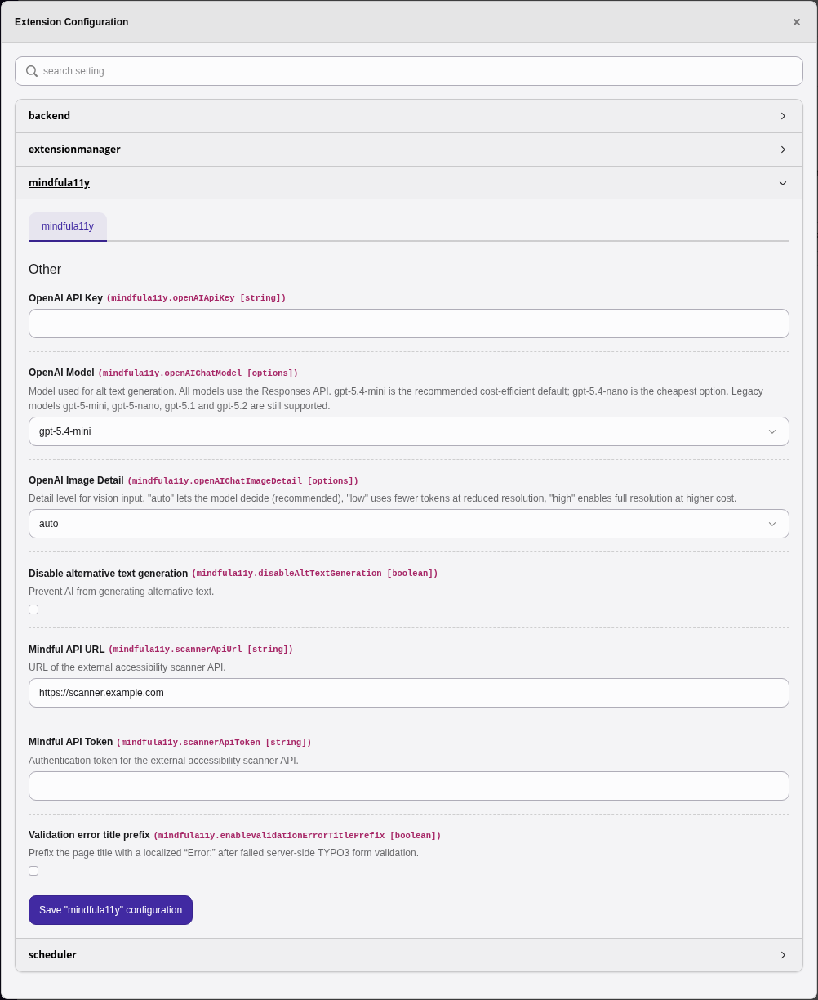
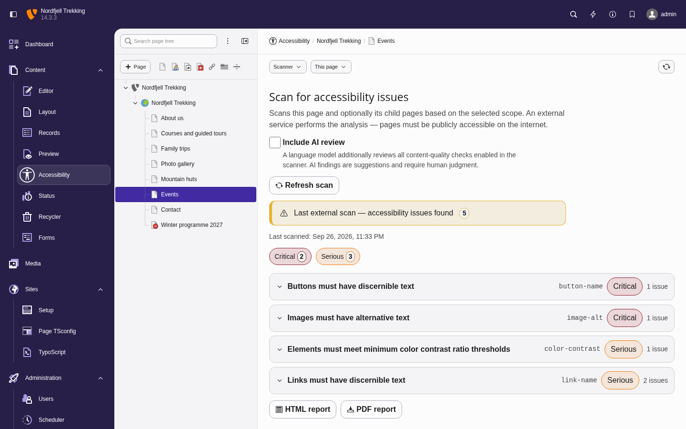
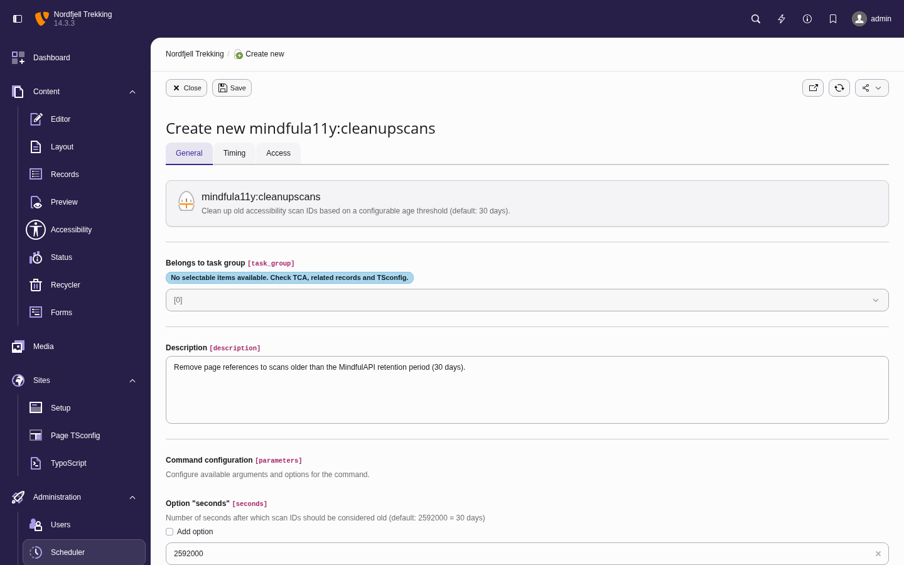

# Integrators

This section is for TYPO3 integrators and administrators configuring the extension.

## Installation

```bash
composer require mindfulmarkup/mindfula11y
vendor/bin/typo3 extension:setup
```

`extension:setup` creates or updates the database fields. Alternatively use
**Admin Tools > Maintenance > Analyze Database Structure**.

Upgrading from a release that stored heading levels in `tx_mindfula11y_headinglevel`? Run the
upgrade wizard **Mindful A11y: Migrate heading type data from old to new field** in
**Admin Tools > Upgrade**, or:

```bash
vendor/bin/typo3 upgrade:run mindfulA11yHeadingTypeStringMigration
```

The wizard only fills empty target fields, so it is safe to run again.

## Feature activation checklist

1. **Templates:** render content headings with `<mindfula11y:heading>` and landmark containers
   with `<mindfula11y:landmark>` (see the [developer guide](../Developers/Index.md)). The
   structure checks analyze any page, but editors can only fix what these ViewHelpers render.
2. **Permissions:** grant editor groups the
   [permissions checklist](#permissions-checklist).
3. **Page TSconfig:** the structure checks and Missing alternative text are on by default. Switch
   features off per page tree where they are not wanted.
4. **Optional:** configure OpenAI for AI alternative text, and the
   [scanner](#scanner-integration).
5. **Optional:** enable the
   [validation-error page-title prefix](#validation-error-page-title-prefix).

## Extension configuration

Configure in **Admin Tools > Settings > Extension Configuration**.



| Setting | Purpose |
| --- | --- |
| `openAIApiKey` | API key for AI alt text generation. |
| `openAIChatModel` | Generation model: `gpt-5.4-mini`, `gpt-5.4-nano`, `gpt-5-mini`, `gpt-5-nano`, `gpt-5.1`, `gpt-5.2`. |
| `openAIChatImageDetail` | Image analysis depth (`auto`, `low`, `high`) — quality vs. cost. |
| `disableAltTextGeneration` | Turns AI generation off globally; manual alt editing stays. |
| `scannerApiUrl` | Scanner base URL: protocol, host, optional port, no path. E.g. `http://localhost:3000` (MindfulAPI Docker default) or `https://scanner.example.com`. |
| `scannerApiToken` | Bearer token for the scanner API, if enabled there. |
| `enableValidationErrorTitlePrefix` | Prefixes the page title with `Error:` after failed EXT:form validation. Off by default. |

### Keeping secrets out of settings.php

The Settings UI writes values in plaintext to `config/system/settings.php`, which is often under
version control. Leave `openAIApiKey` and `scannerApiToken` empty in the UI and set them from
environment variables in `config/system/additional.php`:

```php
$GLOBALS['TYPO3_CONF_VARS']['EXTENSIONS']['mindfula11y']['openAIApiKey'] = getenv('OPENAI_API_KEY') ?: '';
$GLOBALS['TYPO3_CONF_VARS']['EXTENSIONS']['mindfula11y']['scannerApiToken'] = getenv('MINDFULAPI_TOKEN') ?: '';
```

`additional.php` loads after `settings.php`, so these values win at runtime. The Settings UI
still shows and saves the `settings.php` values; it does not reflect the override.

## Page TSconfig

Default options shipped by the extension:

```typoscript
mod {
    mindfula11y_accessibility {
        missingAltText {
            enable = 1
            # ignoreColumns {
            #     <table> = <column>,<column>
            # }
            ignoreFileMetadata = 0
        }
        headingStructure {
            enable = 1
        }
        landmarkStructure {
            enable = 1
        }
        scan {
            enable = 0
            autoCreate = 1
            aiAudit {
                enable = 0
                default = 0
                # skills = image_alt_text,page_title
            }
        }
    }

    web_layout {
        mindfula11y {
            hideInfo = 0
        }
    }
}

TCEFORM.tt_content.tx_mindfula11y_landmark {
    removeItems = main,banner,contentinfo,form
}
```

`removeItems` hides the structural landmark roles (`main`, `banner`, `contentinfo`, `form`) from
the editor's select, so editors do not duplicate landmarks the template already provides. Like
all `TCEFORM` options, it only adjusts the form; it is not an enforced restriction.

### TSconfig options explained

All `mod.*` paths below are relative to `mod.mindfula11y_accessibility` unless shown in full.

| Option | Used for |
| --- | --- |
| `missingAltText.enable` | Shows the Missing alternative text feature. |
| `missingAltText.ignoreColumns` | Excludes file fields from the check, per table: `ignoreColumns { <table> = <column>,<column> }`. |
| `missingAltText.ignoreFileMetadata` | `0` (default): editors can filter out references covered by file metadata alt text, as TYPO3's `FileReference` renders it. `1`: require alt text on every file reference. |
| `headingStructure.enable` | Enables the heading structure check. |
| `landmarkStructure.enable` | Enables the landmark structure check. |
| `scan.enable` | Enables the scanner. |
| `scan.autoCreate` | Starts a new scan on module load when content changed. |
| `scan.basicAuthUsername` | Deprecated — use `mindfula11y.scan.basicAuth.username` in the site configuration ([details](#scanning-pages-behind-http-basic-authentication)). |
| `scan.basicAuthPassword` | Deprecated — use `mindfula11y.scan.basicAuth.password` in the site configuration. |
| `scan.aiAudit.enable` | Offers the "Include AI review" toggle; needs MindfulAPI's agent feature ([AI review](#ai-review-agent-audit)). |
| `scan.aiAudit.default` | Pre-selects the AI review toggle; editors can switch it off per scan. |
| `scan.aiAudit.skills` | Optional comma-separated skill subset. Unset: every MindfulAPI-enabled skill. Empty: none. |
| `mod.web_layout.mindfula11y.hideInfo` | Hides the Mindful A11y info box in the page module. |

## Permissions checklist

Grant editor groups the permissions below. Missing permissions usually show up as hidden or
disabled features, not as errors.

| Permission | Needed for | Without it |
| --- | --- | --- |
| Backend module `mindfula11y_accessibility` | Opening the module | Module not listed under **Web** (TYPO3 14: **Content**). |
| Page read access (`PAGE_SHOW`) in the relevant trees | Selecting pages | "No page selected" / empty results. |
| Allowed languages for the page's languages | Per-language checks | Language menu missing or empty. |
| File mount read access | Listing images in the alt text workflow | Images are not listed. |
| `sys_file_reference` read + field `alternative` | Missing alternative text | Feature hidden. |
| `sys_file_reference` write + field `alternative` | Editing alt text | Field read-only or saving fails. |
| `sys_file_reference` fields `tx_mindfula11y_decorative`, `alternative` and `title` | Marking images decorative (this also empties alt text and title) | Decorative toggle read-only. |
| `sys_file_metadata` field `alternative` | Considering inherited metadata alt text | Inherited alt text ignored. |
| File mount `editMeta` | AI generation on file metadata | Generation disabled for metadata. |
| Edit the page record (page permission "Edit page", `pages` modify, page type allowed, no edit lock), live workspace | Starting scans | Scan actions not offered. |

Editors need no field access to the internal scanner fields `pages.tx_mindfula11y_scanid` and
`pages.tx_mindfula11y_scanupdated`.

## Heading and landmark structure analysis

The structure checks need no external service. Make sure that:

- the editor's browser can load the selected page's frontend;
- the frontend can be framed by the TYPO3 backend: web-server or reverse-proxy
  `X-Frame-Options`/CSP headers added after TYPO3 must allow the backend origin;
- templates use the [ViewHelpers](../Developers/Index.md) for editable results; other headings
  and landmarks are analyzed but read-only;
- behind HTTP Basic Authentication, you follow
  [the section below](#structure-analysis-behind-http-basic-authentication).

The module renders the real frontend in sandboxed iframes at 375 × 812 and 1280 × 900 CSS pixels.
Only the extension's analysis script runs there, so page scripts and JavaScript-generated
structure are not analyzed. Site roots on another domain work too.

Access uses a signed ticket from the backend:

- It is stateless (not stored anywhere) and valid for 15 seconds.
- It is bound to the page, language, workspace, URL, backend user and origin. Moving the page or
  changing its permissions invalidates it.
- Module, page, workspace and language permissions are re-checked when it is redeemed.
- It travels in the query string: use HTTPS and keep query strings out of proxy and monitoring
  logs.

The extension sets the required per-request CSP itself.

### Structure analysis behind HTTP Basic Authentication

The analysis loads the page in the editor's browser, inside a sandboxed frame. The scanner's
[`mindfula11y.scan.basicAuth`](#scanning-pages-behind-http-basic-authentication) setting does
**not** apply — a frame cannot carry credentials. The browser's own authentication cache is used
instead:

- **Same origin, whole host protected (recommended):** editors already signed in to reach
  `/typo3`, so the browser re-sends the credentials. Keep the backend in the same protection
  space as the frontend (one realm for the whole host).
- **Different origin, or backend excluded from protection:** the frame cannot show the sign-in
  prompt. The module offers **Open page in new tab**; sign in there, then **Retry**. The browser
  caches the sign-in per origin until it is closed.

## Scanner integration

The scanner runs automated axe-core checks in a headless browser via the external
[MindfulAPI](https://github.com/crinis/mindfulapi) service. It requires **MindfulAPI 0.7.0 or
later** (versioned `/v1` routes and AI audit fields); older releases are not supported.

1. Run MindfulAPI with Docker:

   ```bash
   git clone https://github.com/crinis/mindfulapi.git
   cd mindfulapi
   cp .env.example .env   # then set AUTH_TOKEN; compose refuses to start without it
   docker compose up -d
   ```

2. Set `scannerApiUrl` and `scannerApiToken` (MindfulAPI's `AUTH_TOKEN`) in
   [Extension configuration](#extension-configuration).
3. Enable the scanner in Page TSconfig: `mod.mindfula11y_accessibility.scan.enable = 1`.

Without `scan.enable = 1` the scanner area is hidden. Without `scannerApiUrl` the module shows a
"not configured" notice. The module does not probe MindfulAPI in advance: connection or API
errors appear in the scan view.



Error messages shown to editors are shortened and never contain the API token or Basic Auth
credentials. The full message is written to the TYPO3 log.

### Scan modes: Targeted scan vs Full-site crawl

- **Targeted scan:** the current page, or its child pages up to `0/1/5/10/99` levels (scan scope
  menu).
- **Full-site crawl:** starts at the page and follows links within the site/language URL space.
  Only offered on site root pages (`is_siteroot = 1`).
- Scans can only be started in the live workspace.
- `scan.autoCreate` only creates single-page scans.


### Scanner quality and limitations

Automated checks reliably find many technical violations, but not everything — for example
content meaning, context or editorial quality. Treat results as a technical baseline and combine
them with manual reviews.

### Scanning pages behind HTTP Basic Authentication

Add the credentials to the site configuration, `config/sites/<identifier>/config.yaml`:

```yaml
base: 'https://staging.example.com/'
rootPageId: 1
# ...
mindfula11y:
  scan:
    basicAuth:
      username: 'scanner'
      password: '%env(MINDFULA11Y_SCAN_BASIC_AUTH_PASSWORD)%'
```

- Both values are required; if one is missing, no credentials are sent.
- The extension sends them server-side to the scanner, only for pages of that site. They never
  reach the browser.
- Use TYPO3's `%env(...)%` placeholder to keep the secret out of the committed file.
- Saving the site in **Site Management > Sites** keeps the `mindfula11y` key and its
  placeholders.
- Use a low-privilege account. Resolved values are visible to administrators in
  **System > Configuration** and cached in `var/cache/code/`, like any TYPO3 configuration value.

Do not put the credentials in site settings (`settings.yaml`): TYPO3 exposes site settings as
resolved TypoScript and page TSconfig constants, so anyone who can write page TSconfig could
print the password.

> Deprecated: the Page TSconfig keys `mod.mindfula11y_accessibility.scan.basicAuthUsername` /
> `basicAuthPassword` still work as a fallback, per page tree and without `%env()%` support. Once
> either key is set in the site configuration, the site configuration wins — an incomplete pair
> sends no credentials rather than falling back to TSconfig.

These credentials apply to the scanner only; for the structure analysis see
[Structure analysis behind HTTP Basic Authentication](#structure-analysis-behind-http-basic-authentication).

### AI review (agent audit)

MindfulAPI can additionally run an **AI audit**: a language model reviews image alternative text,
heading structure, link purpose, form labels and page title, and reports findings with severity,
confidence and suggestions. Findings appear in a separate "AI review" section and always need
human judgement.

1. Enable the agent feature in MindfulAPI: `AGENT_ENABLED=true` plus provider, model and API key
   (see the MindfulAPI README). `AGENT_SKILLS` whitelists the allowed skills.
2. Enable the toggle per page tree in Page TSconfig:

```
mod.mindfula11y_accessibility.scan.aiAudit {
    # Offer the "Include AI review" toggle in the scan module.
    enable = 1
    # Pre-select the toggle for new scans (editors can still switch it off per scan).
    default = 0
    # Optional comma-separated subset. Leave unset to run every skill enabled
    # by MindfulAPI's AGENT_SKILLS setting. Set an empty value to run no skills.
    # skills = image_alt_text,page_title
}
```

- The audit runs **only** when an editor starts a scan with the toggle checked. Automatic scans
  (page module info box, Overview tab) never request it, so browsing the backend costs nothing.
- Each audit consumes LLM tokens on the MindfulAPI side; set `default = 1` deliberately.
- MindfulAPI validates `skills`; its `AGENT_SKILLS` whitelist stays authoritative.
- If MindfulAPI has the feature disabled, scan creation fails and the editor sees the API's
  explanation.

### Scanner troubleshooting

| Symptom | Likely cause | Fix |
| --- | --- | --- |
| Scanner area not visible | `scan.enable` is `0` | Set `mod.mindfula11y_accessibility.scan.enable = 1`. |
| Connection refused / timeout | Wrong `scannerApiUrl`, or MindfulAPI not running | Check `docker compose ps` and reachability **from the TYPO3 container**; check protocol and port, omit any path. |
| `401` / `403` from the scanner | `scannerApiToken` missing or wrong | Match it to MindfulAPI's token. |
| Scans fail or are empty on a protected site | Basic Auth credentials not set | Set **both** `mindfula11y.scan.basicAuth.username` and `.password` ([details](#scanning-pages-behind-http-basic-authentication)). |
| "Scanner not configured" notice | `scannerApiUrl` empty | Set `scannerApiUrl`. |
| Full-site crawl missing | Page is not a site root | Use Targeted scan, or select the `is_siteroot = 1` page. |
| Scan actions missing | Draft workspace, or no edit permission on the page | Switch to live; see [Permissions checklist](#permissions-checklist). |
| "Invalid request signature" when scanning or generating alt text | View or edit form open longer than 15 minutes; signed requests expired | Save changes and reload. |

## Validation-error page-title prefix

When an EXT:form submission fails server-side validation, Mindful A11y prefixes the page title
with a localized `Error:` (`Fehler:` in German). Screen readers announce the failure as soon as the
response loads (GOV.UK validation pattern).

Enable `enableValidationErrorTitlePrefix` in **Admin Tools > Settings > Extension Configuration**;
it is off by default and applies installation-wide, as it is frontend response policy rather than
editor behavior.

`typo3/cms-form` is optional. Without it, the feature stays inactive. With it, detection is
automatic — no Fluid partial, marker, TypoScript or JavaScript needed. Native HTML5 validation
blocks the submission in the browser without a new response, so the title correctly stays
unchanged.

## Maintenance command

```bash
vendor/bin/typo3 mindfula11y:cleanupscans
vendor/bin/typo3 mindfula11y:cleanupscans --seconds=604800
```

Removes `tx_mindfula11y_scanid` from page records whose scan is older than `--seconds` (short
`-s`; positive integer, default `2592000` = 30 days).

Schedule it via Scheduler or cron with a threshold matching MindfulAPI's
`CLEANUP_RETENTION_DAYS`, so page records do not reference deleted scans. It is housekeeping, not
a prerequisite: the module also detects scans MindfulAPI has deleted, forgets the stale ID and —
with `scan.autoCreate` — starts a fresh scan.


