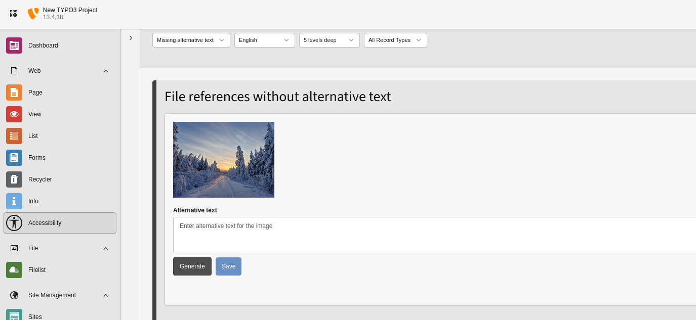
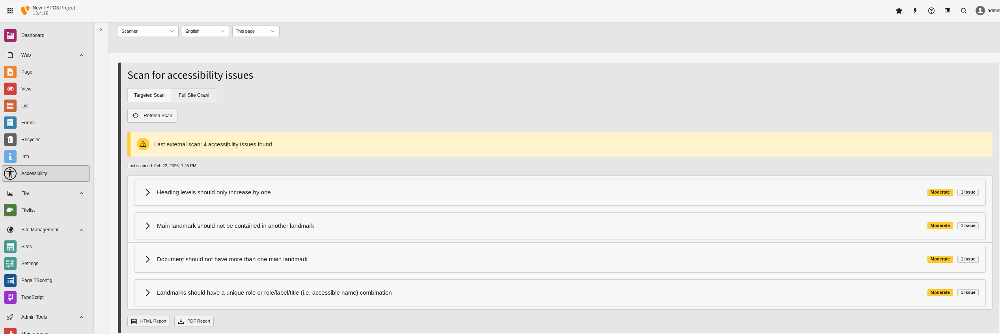

# Mindful A11y for TYPO3

Mindful A11y helps editors and integrators find and fix common accessibility issues directly in the TYPO3 backend.

## What the extension includes

- **Accessibility backend module** with:
  - **General**: heading and landmark structure overview with issue hints.
  - **Missing alternative text**: list, filter, and edit image/file references without alt text.
  - **Scanner (optional)**: run scans, review findings, and export HTML/PDF reports for single or multiple pages or crawls of the entire page tree.
- **Optional AI alt text generation** via OpenAI for missing image alt text.
- **Accessibility fields for content elements** (heading type, landmark, ARIA labels).
- **Fluid ViewHelpers** for accessible heading and landmark rendering and integration with the backend module.
- **Page module info box** with quick accessibility status and links.
- **CLI cleanup command** to cleanup outdated scan results.

Scanner functionality uses the external [MindfulAPI](https://github.com/crinis/mindfulapi) project and is **required** for scanner features. MindfulAPI runs axe-core based technical scans in a headless browser environment. These automated checks are reliable for technical violations but only cover a subset of accessibility issues.

Scanner features are available only when **both** requirements are met:

- MindfulAPI is installed and reachable from TYPO3
- Page TSconfig sets `mod.mindfula11y_accessibility.scan.enable = 1` (default is `0`)





## Requirements

- TYPO3 `13.4.x`
- PHP `8.2` to `8.4`

## Installation

```bash
composer require mindfulmarkup/mindfula11y
```

## Basic setup

1. Install and enable the extension in TYPO3.
2. In **Admin Tools → Settings → Extension Configuration**, set:
   - OpenAI key/model (only if you want AI alt text generation)
   - Scanner API URL/token (only if you want scanner results), for example `http://localhost:3000` or `https://scanner.example.com`
   - For scanner support: set up [MindfulAPI](https://github.com/crinis/mindfulapi) with Docker first
3. Enable or disable module sections via Page TSconfig:
   - `mod.mindfula11y_accessibility.missingAltText.enable`
   - `mod.mindfula11y_accessibility.headingStructure.enable`
   - `mod.mindfula11y_accessibility.landmarkStructure.enable`
   - `mod.mindfula11y_accessibility.scan.enable = 1` to use scanner features (off by default)

## Full documentation

See `Documentation/Index.md` for complete docs with separate guides for editors, integrators, and developers.

- Editors: `Documentation/Editors/Index.md`
- Integrators: `Documentation/Integrators/Index.md`
- Developers: `Documentation/Developers/Index.md`

## License

GPL-2.0-or-later
