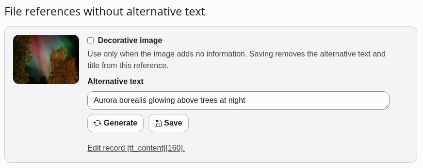
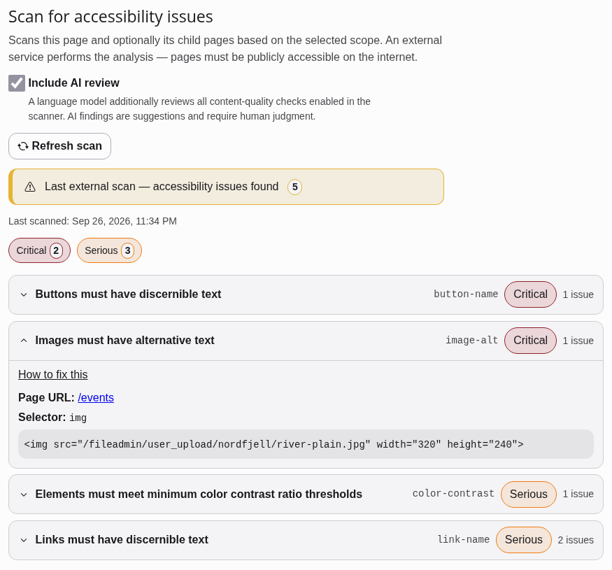

# Mindful A11y for TYPO3

Mindful A11y helps editors and integrators find and fix common accessibility issues directly in
the TYPO3 backend.

## What the extension includes

- **Heading and landmark checks** in the Accessibility module and the page module. The rendered
  page is analyzed at mobile and desktop sizes. Findings such as skipped heading levels or
  ambiguous landmark names show in a structure tree.
- **Fixing in place:** editors change heading levels and landmark roles right in that tree.
  Requires templates that use the extension's Fluid ViewHelpers.
- **Missing alternative text:** find, filter and fix images without alternative text, mark them
  decorative, and optionally generate suggestions with OpenAI.
- **Accessibility fields** for content elements: heading type, landmark role and landmark name.
- **Scanner (optional):** axe-core scans of pages, page trees or whole sites via the external
  [MindfulAPI](https://github.com/crinis/mindfulapi) service, with HTML/PDF reports and an
  optional AI review.
- **Page module info box** with the page's accessibility status.
- **Form error titles (optional):** a localized `Error:` page-title prefix after failed EXT:form
  validation.





## Requirements

- TYPO3 `13.4 LTS` (13.4.18 or later) or `14.3 LTS`
- PHP `8.2` to `8.4`
- Optional, for the scanner: [MindfulAPI](https://github.com/crinis/mindfulapi) `v0.7.0` or later
  (`v0.7.1` or later for the AI review), reachable from TYPO3. Its axe-core checks reliably find
  technical violations but cover only a subset of accessibility issues.
- Optional, for AI alternative text: an OpenAI API key
- Optional, for the form-error title prefix: `typo3/cms-form`

## Installation

```bash
composer require mindfulmarkup/mindfula11y
vendor/bin/typo3 extension:setup
```

`extension:setup` creates the database fields. Upgrading from a release that stored heading
levels in `tx_mindfula11y_headinglevel`? Also run the upgrade wizard "Mindful A11y: Migrate
heading type data from old to new field".

## Basic setup

1. **Templates:** render content headings with `<mindfula11y:heading>` and landmark containers
   with `<mindfula11y:landmark>` (see the [developer guide](Documentation/Developers/Index.md)).
   The structure checks work on any page, but only headings and landmarks rendered through the
   ViewHelpers can be fixed from the backend.
2. **Permissions:** grant editor groups access to the Accessibility module and the relevant
   tables and fields (see the
   [permissions checklist](Documentation/Integrators/Index.md#permissions-checklist)).
3. **Optional features** in **Admin Tools → Settings → Extension Configuration**:
   - OpenAI key and model for AI alternative text
   - `scannerApiUrl` and `scannerApiToken` for the scanner, then enable it per page tree with
     `mod.mindfula11y_accessibility.scan.enable = 1` (off by default)
   - `enableValidationErrorTitlePrefix` for the form-error title prefix (off by default)

The structure checks and the Missing alternative text view are on by default. Switch them off
per page tree via Page TSconfig (`mod.mindfula11y_accessibility.headingStructure.enable`,
`.landmarkStructure.enable`, `.missingAltText.enable`).

## Full documentation

See [Documentation/Index.md](Documentation/Index.md), with separate guides per role:

- [Editors](Documentation/Editors/Index.md)
- [Integrators](Documentation/Integrators/Index.md)
- [Developers](Documentation/Developers/Index.md)

## License

GPL-2.0-or-later
