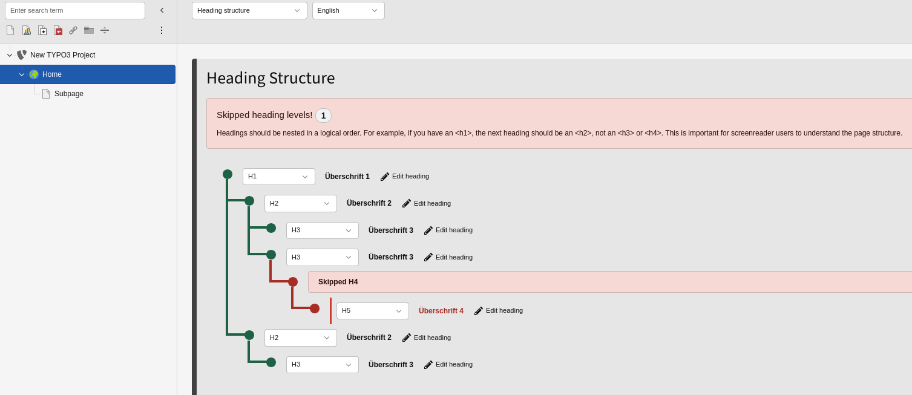

# Mindful A11y TYPO3 Extension

Mindful A11y is a TYPO3 extension that integrates accessibility tools directly into the TYPO3 backend, helping editors and integrators improve the accessibility of their content.

> **Note:** This extension is in an early stage of development. I do not recommend using it in production environments at this time.

## Installation

Install via Composer:

```bash
composer require mindfulmarkup/mindfula11y
```

## Features

- **Alternative Text Checker**: Backend module that lists all `sys_file_reference` records (e.g., images) without alternative text, making it easy to find and fix missing alt attributes.
- **AI-Powered Alt Text Generation**: Supports generating alternative texts for images using ChatGPT.
- **Heading Structure Overview**: Backend module that visualizes the heading structure of content elements and allows editors to easily review and edit heading types for records using the custom ViewHelper.
- **Landmark Structure Overview**: Backend module that displays ARIA landmarks on the page in a visual, hierarchical layout. Editors can review landmark structure, identify accessibility issues, and edit landmark roles directly from the backend to improve page navigation and semantic structure.

## Planned Features

- **Automated Accessibility Scanners**: Integration of automated accessibility testing tools to review and report accessibility problems directly in the backend.

## Extension Settings

You can configure Mindful A11y in the extension settings:

- **OpenAI API Key**: Set your OpenAI API key for ChatGPT-powered features.
- **Chat Model**: Choose the OpenAI model for generating alternative text (e.g., `gpt-4o-mini`, `gpt-4o`).
- **Image Detail**: Set the detail level for image analysis (`low` or `high`).
- **Disable Alt Text Generation**: Option to disable the AI-powered alternative text generation. Also inactive if no OpenAI API key is set.

## Page TSconfig Options

Configure module behavior per page using Page TSconfig (`Configuration/page.tsconfig`):

```
mod {
    mindfula11y_missingalttext {
        enable = 1
        ignoreColumns {
            # Do not include column `image` from table `tt_content` in the alternative text check.
            tt_content = image
        }
    }
    mindfula11y_headingstructure {
        enable = 1
    }
    mindfula11y_landmarkstructure {
        enable = 1
    }
}
```

## Finding images with missing alternative text

The Accessibility module provides a list of `sys_file_reference` records that do not have alternative text set. This helps editors identify and fix images that are missing accessibility information.

### Backend Module Integration

The Missing Alt Text checker is integrated into the main Accessibility backend module and provides filtering options based on:

- **Current Page**: Results are shown for the currently selected page in the page tree
- **Record Type**: Filter by specific tables (e.g., `tt_content`, `pages`) or show all record types
- **Language**: Filter results by specific languages
- **Recursive Depth**: Choose how many page levels to scan (1, 5, 10, or 99 levels deep)


*The Missing Alt Text module showing the list of images without alternative text with inline editing capabilities. Also allowing to generate an alternative text using ChatGPT if configured.*

### Inline Editing

Each missing alternative text entry provides:

- **Image Preview**: Thumbnail display with link to view the full-size image
- **Alternative Text Input**: Multi-line text area for entering descriptive text
- **AI Generation**: When ChatGPT is configured, a "Generate" button automatically creates alternative text
- **Save Functionality**: Individual saving for each image
- **Record Link**: Direct access to edit the original record containing the file reference

### Configuration Options

The module can be configured using Page TSconfig to exclude specific columns:

```
mod {
    mindfula11y_missingalttext {
        enable = 1
        ignoreColumns {
            # Exclude specific columns from the alternative text check
            tt_content = image,media
            pages = media
        }
    }
}
```

## Heading Types

The Mindful A11y extension adds a `tx_mindfula11y_headingtype` column to the `tt_content` table, allowing editors (with appropriate permissions) to set the semantic heading type for content elements. This enables precise control over the document's heading hierarchy for better accessibility.

### What are Heading Types?

Heading types define the semantic level and HTML element used to render headings in your content. Proper heading structure is crucial for accessibility, as screen readers and other assistive technologies use headings to navigate and understand the page structure.

### Available Heading Types

The extension provides the following heading type options:

- **H1-H6**: Semantic heading levels (`<h1>` through `<h6>`) for proper document structure
- **Paragraph (p)**: For text that should be rendered as a paragraph rather than a heading (`<p>`)
- **Generic div (div)**: For content that needs custom styling without any semantic meaning (`<div>`)

### Backend Module Integration

Headings are displayed in a tree structure within the Accessibility backend module, providing editors with a clear overview of the page's heading hierarchy. The module identifies accessibility issues such as missing H1 elements or skipped heading levels, and allows for easy editing of heading types directly from the tree view.


*The Heading Structure module showing the hierarchical tree of headings with inline editing capabilities. Helping editors to catch errors.*

### Using the Heading ViewHelper

To apply heading types in the frontend, use the provided `HeadingViewHelper`. The ViewHelper renders the appropriate HTML element based on the stored heading type and integrates with the backend module for inline editing capabilities.

#### Basic Usage for tt_content Records

```html
<mindfula11y:heading 
    recordUid="{data.uid}" 
    recordTableName="tt_content" 
    recordColumnName="tx_mindfula11y_headingtype" 
    type="{data.tx_mindfula11y_headingtype}">
    {data.header}
</mindfula11y:heading>
```

#### Dependent Child Headings

For child headings that should automatically adjust based on their parent heading level, you can use Fluid's mathematical operations with the `f:variable` ViewHelper:

```html
<f:comment>Parent heading</f:comment>
<mindfula11y:heading 
    recordUid="{data.uid}" 
    recordTableName="tt_content" 
    recordColumnName="tx_mindfula11y_headingtype" 
    type="{data.tx_mindfula11y_headingtype}">
    {data.header}
</mindfula11y:heading>

<f:comment>Child heading that adapts to parent level</f:comment>
<f:if condition="{data.tx_mindfula11y_headingtype} == 'p' || {data.tx_mindfula11y_headingtype} == 'div'">
    <f:then>
        <f:comment>Non-semantic parent: use same type for child</f:comment>
        <f:variable name="childType" value="{data.tx_mindfula11y_headingtype}" />
    </f:then>
    <f:else>
        <f:comment>Semantic heading parent: increment level</f:comment>
        <f:variable name="parentLevel" value="{f:replace(subject: data.tx_mindfula11y_headingtype, search: 'h', replace: '')}" />
        <f:variable name="childLevel" value="{f:if(condition: '{parentLevel} < 6', then: '{parentLevel + 1}', else: '6')}" />
        <f:variable name="childType" value="h{childLevel}" />
    </f:else>
</f:if>

<mindfula11y:heading type="{childType}">
    {data.subheader}
</mindfula11y:heading>
```

This example handles both semantic headings (h1-h6) and non-semantic elements (p, div). For semantic headings, it increments the level by 1. For non-semantic elements, the child uses the same type as the parent.

### Extending Custom Record Types

To add heading type support to custom record types, follow these steps:

#### 1. Add TCA Column Definition

Create a TCA override file for your custom table (e.g., `Configuration/TCA/Overrides/tx_myext_records.php`):

```php
<?php
declare(strict_types=1);

use MindfulMarkup\MindfulA11y\Enum\HeadingType;
use TYPO3\CMS\Core\Utility\ExtensionManagementUtility;

defined('TYPO3') or die();

// Add the heading type column to your custom table
ExtensionManagementUtility::addTCAcolumns(
    'tx_myext_records',
    [
        'headingtype' => [
            'exclude' => true,
            'label' => 'LLL:EXT:mindfula11y/Resources/Private/Language/Database.xlf:ttContent.columns.mindfula11y.headingType',
            'config' => [
                'type' => 'select',
                'renderType' => 'selectSingle',
                'default' => HeadingType::H2->value,
                'items' => [
                    ['label' => HeadingType::H1->getLabelKey(), 'value' => HeadingType::H1->value],
                    ['label' => HeadingType::H2->getLabelKey(), 'value' => HeadingType::H2->value],
                    ['label' => HeadingType::H3->getLabelKey(), 'value' => HeadingType::H3->value],
                    ['label' => HeadingType::H4->getLabelKey(), 'value' => HeadingType::H4->value],
                    ['label' => HeadingType::H5->getLabelKey(), 'value' => HeadingType::H5->value],
                    ['label' => HeadingType::H6->getLabelKey(), 'value' => HeadingType::H6->value],
                    ['label' => HeadingType::P->getLabelKey(), 'value' => HeadingType::P->value],
                    ['label' => HeadingType::DIV->getLabelKey(), 'value' => HeadingType::DIV->value],
                ],
            ],
        ],
    ]
);

// Add the field to your record type's interface
ExtensionManagementUtility::addToAllTCAtypes(
    'tx_myext_records',
    'headingtype',
    '',
    'after:title'
);
```

#### 2. Update Database Schema

Add the database column to your `ext_tables.sql`:

```sql
CREATE TABLE tx_myext_records (
    headingtype varchar(10) DEFAULT 'h2' NOT NULL
);
```

> **Note:** In TYPO3 13+, database schema updates are handled automatically based on TCA configuration, so manual `ext_tables.sql` definitions are no longer required for TCA-defined fields.

#### 3. Use in Fluid Templates

In your Fluid templates, use the ViewHelper with your custom table:

```html
<mindfula11y:heading 
    recordUid="{record.uid}" 
    recordTableName="tx_myext_records" 
    recordColumnName="headingtype" 
    type="{record.headingtype}">
    {record.title}
</mindfula11y:heading>
```

This integration allows your custom records to benefit from the same heading structure analysis and inline editing capabilities provided by the Accessibility backend module.

## Landmarks

The Mindful A11y extension adds landmark-related columns to the `tt_content` table, allowing editors to define ARIA landmarks for better page navigation. These landmarks help screen reader users understand the structure and purpose of different page sections.

### What are Landmarks?

ARIA landmarks identify the purpose of different sections of a page, making it easier for assistive technology users to navigate content. They provide semantic meaning to regions of a page and allow users to quickly jump between different sections.

### Available Landmark Types

The extension provides the following landmark options:

- **None**: No landmark role applied
- **Region**: Important Section (only if none of the other options apply)
- **Navigation**: Navigation Menu (`<nav>`)
- **Complementary**: Sidebar / Related Content (`<aside>`)
- **Main**: Main Content Area (`<main>`)
- **Banner**: Site Header (`<header>`)
- **Contentinfo**: Site Footer (`<footer>`)
- **Search**: Search Function (`<search>`)
- **Form**: Form Section (`<form>`)

### Landmark Columns

The extension adds three columns to support landmarks:

- **`tx_mindfula11y_landmark`**: The landmark type/role
- **`tx_mindfula11y_arialabelledby`**: Checkbox to use the content element's header as the landmark name
- **`tx_mindfula11y_arialabel`**: Custom landmark name (when not using the header)

### Backend Module Integration

Landmarks are displayed in a hierarchical layout within the Accessibility backend module, providing editors with a clear overview of the page's landmark structure. The module identifies many accessibility issues and allows for easy editing of landmark roles and names directly from the structure view.


*The Landmark Structure module showing the hierarchical layout of landmarks with inline editing capabilities listing errors on the top.*

### Using the Landmark ViewHelper

To apply landmarks in the frontend, use the provided `LandmarkViewHelper`. The ViewHelper renders the appropriate HTML element based on the landmark type and integrates with the backend module for inline editing capabilities.

#### Basic Usage for tt_content Records

```html
<f:variable name="ariaAttributes" value="{}" />
<f:if condition="{data.tx_mindfula11y_arialabelledby} && {data.header}">
    <f:then>
        <f:variable name="ariaAttributes" value="{labelledby: 'c{data.uid}-heading'}" />
    </f:then>
    <f:else>
        <f:if condition="{data.tx_mindfula11y_arialabel}">
            <f:variable name="ariaAttributes" value="{label: data.tx_mindfula11y_arialabel}" />
        </f:if>
    </f:else>
</f:if>

<mindfula11y:landmark 
    recordUid="{data.uid}" 
    recordTableName="tt_content" 
    recordColumnName="tx_mindfula11y_landmark" 
    role="{data.tx_mindfula11y_landmark}" 
    fallbackTag="div"
    aria="{ariaAttributes}">
    {data.bodytext}
</mindfula11y:landmark>
```

### Extending Custom Record Types

To add landmark support to custom record types, follow these steps:

#### 1. Add TCA Column Definitions

Create a TCA override file for your custom table (e.g., `Configuration/TCA/Overrides/tx_myext_records.php`):

```php
<?php
declare(strict_types=1);

use MindfulMarkup\MindfulA11y\Enum\AriaLandmark;
use TYPO3\CMS\Core\Utility\ExtensionManagementUtility;

defined('TYPO3') or die();

// Add the landmark columns to your custom table
ExtensionManagementUtility::addTCAcolumns(
    'tx_myext_records',
    [
        'landmark' => [
            'exclude' => true,
            'label' => 'LLL:EXT:mindfula11y/Resources/Private/Language/Database.xlf:ttContent.columns.mindfula11y.landmark',
            'description' => 'LLL:EXT:mindfula11y/Resources/Private/Language/Database.xlf:ttContent.columns.mindfula11y.landmark.description',
            'onChange' => 'reload',
            'config' => [
                'type' => 'select',
                'renderType' => 'selectSingle',
                'default' => AriaLandmark::NONE->value,
                'items' => [
                    ['label' => 'LLL:EXT:mindfula11y/Resources/Private/Language/Database.xlf:ttContent.columns.mindfula11y.landmark.items.none', 'value' => AriaLandmark::NONE->value],
                    ['label' => 'LLL:EXT:mindfula11y/Resources/Private/Language/Database.xlf:ttContent.columns.mindfula11y.landmark.items.region', 'value' => AriaLandmark::REGION->value],
                    ['label' => 'LLL:EXT:mindfula11y/Resources/Private/Language/Database.xlf:ttContent.columns.mindfula11y.landmark.items.navigation', 'value' => AriaLandmark::NAVIGATION->value],
                    ['label' => 'LLL:EXT:mindfula11y/Resources/Private/Language/Database.xlf:ttContent.columns.mindfula11y.landmark.items.complementary', 'value' => AriaLandmark::COMPLEMENTARY->value],
                    ['label' => 'LLL:EXT:mindfula11y/Resources/Private/Language/Database.xlf:ttContent.columns.mindfula11y.landmark.items.main', 'value' => AriaLandmark::MAIN->value],
                    ['label' => 'LLL:EXT:mindfula11y/Resources/Private/Language/Database.xlf:ttContent.columns.mindfula11y.landmark.items.banner', 'value' => AriaLandmark::BANNER->value],
                    ['label' => 'LLL:EXT:mindfula11y/Resources/Private/Language/Database.xlf:ttContent.columns.mindfula11y.landmark.items.contentinfo', 'value' => AriaLandmark::CONTENTINFO->value],
                    ['label' => 'LLL:EXT:mindfula11y/Resources/Private/Language/Database.xlf:ttContent.columns.mindfula11y.landmark.items.search', 'value' => AriaLandmark::SEARCH->value],
                    ['label' => 'LLL:EXT:mindfula11y/Resources/Private/Language/Database.xlf:ttContent.columns.mindfula11y.landmark.items.form', 'value' => AriaLandmark::FORM->value],
                ],
            ],
        ],
        'aria_labelledby' => [
            'exclude' => true,
            'label' => 'LLL:EXT:mindfula11y/Resources/Private/Language/Database.xlf:ttContent.columns.mindfula11y.ariaLabelledby',
            'description' => 'LLL:EXT:mindfula11y/Resources/Private/Language/Database.xlf:ttContent.columns.mindfula11y.ariaLabelledby.description',
            'displayCond' => 'FIELD:landmark:!=:',
            'onChange' => 'reload',
            'config' => [
                'type' => 'check',
                'renderType' => 'checkboxToggle',
                'default' => 1,
                'items' => [['label' => '', 'value' => '']],
            ],
        ],
        'aria_label' => [
            'exclude' => true,
            'label' => 'LLL:EXT:mindfula11y/Resources/Private/Language/Database.xlf:ttContent.columns.mindfula11y.ariaLabel',
            'description' => 'LLL:EXT:mindfula11y/Resources/Private/Language/Database.xlf:ttContent.columns.mindfula11y.ariaLabel.description',
            'displayCond' => [
                'AND' => [
                    'FIELD:landmark:!=:',
                    'FIELD:aria_labelledby:=:0'
                ]
            ],
            'config' => [
                'type' => 'input',
                'size' => 50,
                'max' => 255,
                'eval' => 'trim',
                'required' => true,
            ],
        ],
    ]
);

// Add landmark palette
$GLOBALS['TCA']['tx_myext_records']['palettes']['landmarks'] = [
    'label' => 'LLL:EXT:mindfula11y/Resources/Private/Language/Database.xlf:ttContent.palettes.landmarks',
    'showitem' => 'landmark, --linebreak--, aria_labelledby, aria_label'
];

// Add the accessibility tab with landmarks palette
ExtensionManagementUtility::addToAllTCAtypes(
    'tx_myext_records',
    '--div--;LLL:EXT:mindfula11y/Resources/Private/Language/Database.xlf:ttContent.tabs.accessibility, --palette--;LLL:EXT:mindfula11y/Resources/Private/Language/Database.xlf:ttContent.palettes.landmarks;landmarks'
);
```

#### 2. Update Database Schema

Add the database columns to your `ext_tables.sql`:

```sql
CREATE TABLE tx_myext_records (
    landmark varchar(15) DEFAULT '' NOT NULL,
    aria_labelledby tinyint(1) DEFAULT 1 NOT NULL,
    aria_label varchar(255) DEFAULT '' NOT NULL
);
```

> **Note:** In TYPO3 13+, database schema updates are handled automatically based on TCA configuration, so manual `ext_tables.sql` definitions are no longer required for TCA-defined fields.

#### 3. Use in Fluid Templates

In your Fluid templates, use the ViewHelper with your custom table:

```html
<f:variable name="ariaAttributes" value="{}" />
<f:if condition="{record.aria_labelledby} && {record.title}">
    <f:then>
        <f:variable name="ariaAttributes" value="{labelledby: 'record-{record.uid}-title'}" />
    </f:then>
    <f:else>
        <f:if condition="{record.aria_label}">
            <f:variable name="ariaAttributes" value="{label: record.aria_label}" />
        </f:if>
    </f:else>
</f:if>

<mindfula11y:landmark 
    recordUid="{record.uid}" 
    recordTableName="tx_myext_records" 
    recordColumnName="landmark" 
    role="{record.landmark}" 
    fallbackTag="div"
    aria="{ariaAttributes}">
    {record.content}
</mindfula11y:landmark>
```

This integration allows your custom records to benefit from the same landmark structure analysis and inline editing capabilities provided by the Accessibility backend module.

## License

This project is licensed under the [GNU General Public License v2.0 (GPL-2.0)](https://www.gnu.org/licenses/old-licenses/gpl-2.0.html). See the [LICENSE](LICENSE) file for details.
